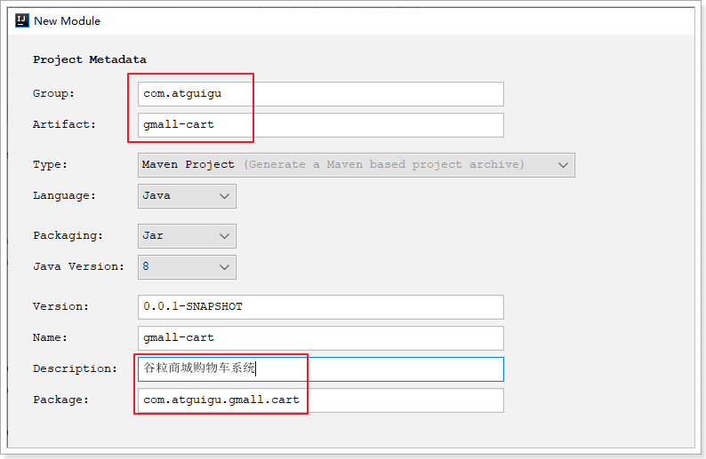
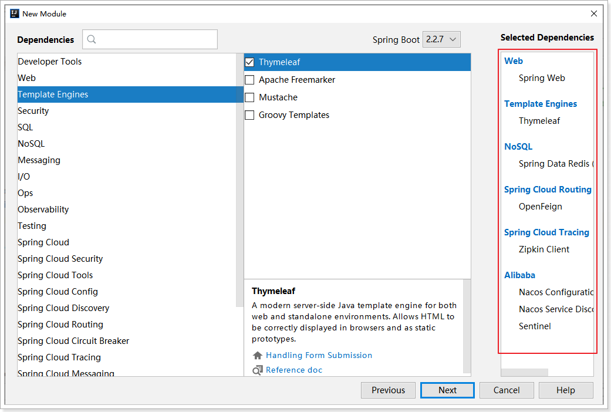
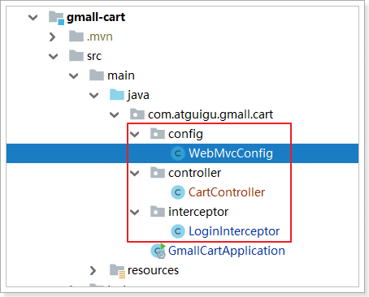
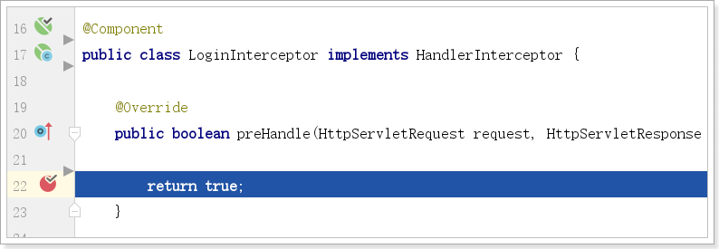
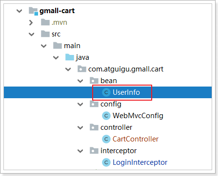
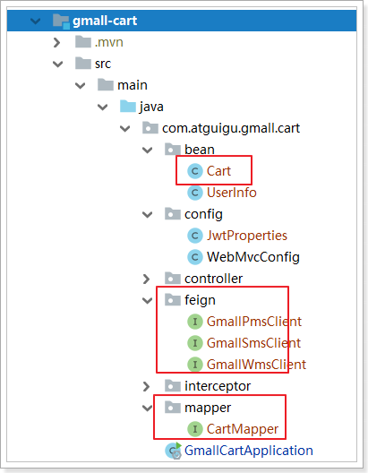
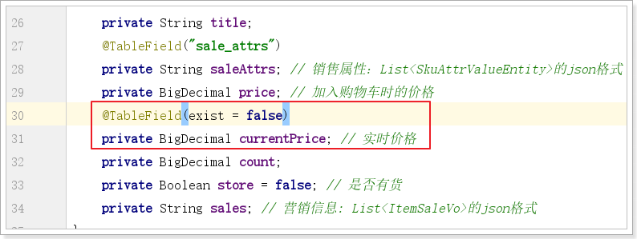
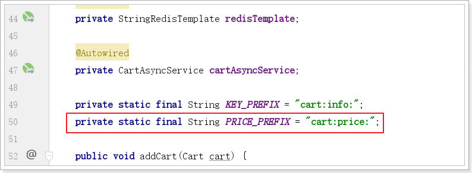
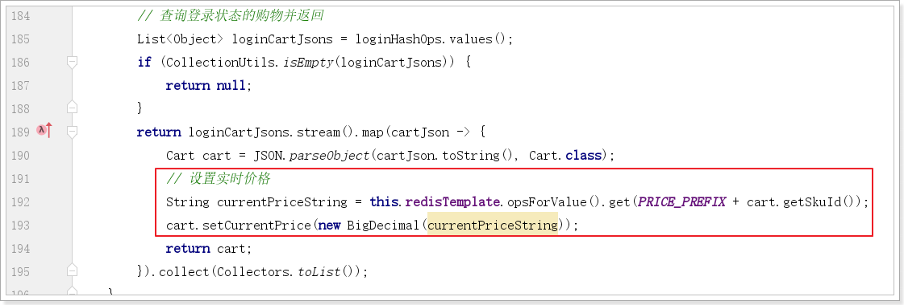

# 1. 购物车功能分析

## 1.1. 功能需求

       程序源码论坛-1024，网址 www.cx1314.cn  仅分享最流行最优质的IT资源！	
    
       不同于其他论坛平台，这里只有精品、稀有资源，已泛滥、已过时、垃圾资源不录入！
    
       Java,前端,python,人工智能,大数据,云计算...持续更新资源-最新完整且均不加密、、、

活动线报，宅男福利，最新大片...

       程序员的新大陆-更新最快的IT资源社区！开发者必备平台！
    
       欢迎访问：www.cx1314.cn      百度搜索->  程序源码论坛
需求描述：

- 用户可以在登录状态下将商品添加到购物车
- 用户可以在未登录状态下将商品添加到购物车
- 用户可以使用购物车一起结算下单
- 用户可以查询自己的购物车
- 用户可以在购物车中修改购买商品的数量。
- 用户可以在购物车中删除商品。
- 在购物车中展示商品优惠信息
- 提示购物车商品价格变化

提示购物车商品价格变化，数据结构，首先分析一下购物车的数据结构


## 1.2. 数据结构

首先分析一下购物车的数据结构


因此每一个购物车信息，都是一个对象，基本字段包括：

```js
{
    id: 1,
    userId: '2',
    skuId: 2131241,
    check: true, // 选中状态
    title: "Apple iphone.....",
    image: "...",
    price: 4999,
    count: 1,
    store: true, // 是否有货
    saleAttrs: [{..},{..}], // 销售属性
    sales: [{..},{..}] // 营销信息
}
```

另外，购物车中不止一条数据，因此最终会是对象的数组。即：

```js
[
    {...},{...},{...}
]
```


## 1.3. 怎么保存

由于购物车是一个读多写多的场景，为了应对高并发场景，所有购物车采用的存储方案也和其他功能，有所差别。

主流的购物车数据**存储方案**：

1. redis（登录/未登录）：性能高，代价高，不利于数据分析
2. mysql（登录/未登录）：性能低，成本低，利于数据分析
3. cookie（未登录）：未登录时，不需要和服务器交互，性能提高。其他请求会占用带宽
4. localStorage/IndexedDB/WebSQL（未登录）：不需要和服务器交互，不占用带宽

一般情况下，企业级购物车通常采用**组合方案**：

1. cookie（未登录时） + mysql（登录时）
2. cookie（未登录） + redis（登录时）
3. localStorage/IndexedDB/WebSQL（未登录） + redis（登录）
4. localStorage/IndexedDB/WebSQL（未登录） + mysql（登录）

随着数据价值的提升，企业越来越重视用户数据的收集，现在以上4种方案使用的越来越少。

当前大厂普遍采用：**redis + mysql**。

不管是否登录都把数据保存到mysql，为了提高性能可以搭建mysql集群，并引入redis。

查询时，从redis查询提高查询速度，写入时，采用双写模式

mysql保存购物车很简单，创建一张购物车表即可。

Redis有5种不同数据结构，这里选择哪一种比较合适呢？`Map<String, List<String>>`

- 首先不同用户应该有独立的购物车，因此购物车应该以用户的作为key来存储，Value是用户的所有购物车信息。这样看来基本的`k-v`结构就可以了。
- 但是，我们对购物车中的商品进行增、删、改操作，基本都需要根据商品id进行判断，为了方便后期处理，我们的购物车也应该是`k-v`结构，key是商品id，value才是这个商品的购物车信息。

综上所述，我们的购物车结构是一个双层Map：`Map<String,Map<String,String>>` 

- 第一层Map，Key是用户id
- 第二层Map，Key是购物车中商品id，值是购物车数据


## 1.4. 流程分析

参照jd：


user-key是游客id，不管有没有登录都会有这个cookie信息。

两个功能：新增商品到购物车、查询购物车。

新增商品：判断是否登录

- 是：则添加商品到后台Redis+mysql中，把user的唯一标识符作为key。
- 否：则添加商品到后台Redis+mysql中，使用随机生成的user-key作为key。

查询购物车列表：判断是否登录

- 否：直接根据user-key查询redis中数据并展示
- 是：已登录，则需要先根据user-key查询redis是否有数据。
  - 有：需要先合并数据（redis + mysql），而后查询。
  - 否：直接去后台查询redis，而后返回。


# 2. 搭建购物车服务

## 2.1. 表设计

创建guli_cart数据库，创建下表：

```mysql
CREATE TABLE `cart_info` (
  `id` bigint(20) NOT NULL AUTO_INCREMENT,
  `user_id` varchar(30) NOT NULL COMMENT '用户id或者userKey',
  `sku_id` bigint(20) NOT NULL COMMENT 'skuId',
  `check` tinyint(4) NOT NULL COMMENT '选中状态',
  `title` varchar(255) NOT NULL COMMENT '标题',
  `default_image` varchar(255) DEFAULT NULL COMMENT '默认图片',
  `price` decimal(18,2) NOT NULL COMMENT '加入购物车时价格',
  `count` int(11) NOT NULL COMMENT '数量',
  `store` tinyint(4) NOT NULL COMMENT '是否有货',
  `sale_attrs` varchar(100) DEFAULT NULL COMMENT '销售属性（json格式）',
  `sales` varchar(255) DEFAULT NULL COMMENT '营销信息（json格式）',
  PRIMARY KEY (`id`),
  KEY `idx_uid_sid` (`user_id`,`sku_id`)
) ENGINE=InnoDB DEFAULT CHARSET=utf8;
```


## 2.2. 创建工程

购物车系统也应该搭建两个工程，购物车服务的提供方（CRUD操作）及服务消费方（为页面提供数据）。

这里我们只搭建一个工程，推荐你们尝试搭建两个工程






pom依赖：

```xml
<?xml version="1.0" encoding="UTF-8"?>
<project xmlns="http://maven.apache.org/POM/4.0.0" xmlns:xsi="http://www.w3.org/2001/XMLSchema-instance"
         xsi:schemaLocation="http://maven.apache.org/POM/4.0.0 https://maven.apache.org/xsd/maven-4.0.0.xsd">
    <modelVersion>4.0.0</modelVersion>
    <parent>
        <groupId>com.atguigu</groupId>
        <artifactId>gmall-1010</artifactId>
        <version>0.0.1-SNAPSHOT</version>
    </parent>
    <groupId>com.atguigu</groupId>
    <artifactId>gmall-cart</artifactId>
    <version>0.0.1-SNAPSHOT</version>
    <name>gmall-cart</name>
    <description>谷粒商城购物车系统</description>

    <properties>
        <java.version>1.8</java.version>
    </properties>

    <dependencies>
        <dependency>
            <groupId>com.atguigu</groupId>
            <artifactId>gmall-common</artifactId>
            <version>0.0.1-SNAPSHOT</version>
        </dependency>
        <dependency>
            <groupId>com.atguigu</groupId>
            <artifactId>gmall-pms-interface</artifactId>
            <version>0.0.1-SNAPSHOT</version>
        </dependency>
        <dependency>
            <groupId>com.atguigu</groupId>
            <artifactId>gmall-sms-interface</artifactId>
            <version>0.0.1-SNAPSHOT</version>
        </dependency>
        <dependency>
            <groupId>com.atguigu</groupId>
            <artifactId>gmall-wms-interface</artifactId>
            <version>0.0.1-SNAPSHOT</version>
        </dependency>
        <dependency>
            <groupId>com.atguigu</groupId>
            <artifactId>gmall-cart-interface</artifactId>
            <version>0.0.1-SNAPSHOT</version>
        </dependency>
        <dependency>
            <groupId>com.baomidou</groupId>
            <artifactId>mybatis-plus-boot-starter</artifactId>
        </dependency>
        <dependency>
            <groupId>mysql</groupId>
            <artifactId>mysql-connector-java</artifactId>
        </dependency>
        <dependency>
            <groupId>org.springframework.boot</groupId>
            <artifactId>spring-boot-starter-data-redis</artifactId>
        </dependency>
        <dependency>
            <groupId>org.springframework.boot</groupId>
            <artifactId>spring-boot-starter-web</artifactId>
        </dependency>
        <dependency>
            <groupId>org.springframework.boot</groupId>
            <artifactId>spring-boot-starter-thymeleaf</artifactId>
        </dependency>
        <dependency>
            <groupId>com.alibaba.cloud</groupId>
            <artifactId>spring-cloud-starter-alibaba-nacos-config</artifactId>
        </dependency>
        <dependency>
            <groupId>com.alibaba.cloud</groupId>
            <artifactId>spring-cloud-starter-alibaba-nacos-discovery</artifactId>
        </dependency>
        <dependency>
            <groupId>com.alibaba.cloud</groupId>
            <artifactId>spring-cloud-starter-alibaba-sentinel</artifactId>
        </dependency>
        <dependency>
            <groupId>org.springframework.cloud</groupId>
            <artifactId>spring-cloud-starter-openfeign</artifactId>
        </dependency>
        <dependency>
            <groupId>org.springframework.cloud</groupId>
            <artifactId>spring-cloud-starter-zipkin</artifactId>
        </dependency>

        <dependency>
            <groupId>org.springframework.boot</groupId>
            <artifactId>spring-boot-starter-test</artifactId>
            <scope>test</scope>
            <exclusions>
                <exclusion>
                    <groupId>org.junit.vintage</groupId>
                    <artifactId>junit-vintage-engine</artifactId>
                </exclusion>
            </exclusions>
        </dependency>
    </dependencies>

    <build>
        <plugins>
            <plugin>
                <groupId>org.springframework.boot</groupId>
                <artifactId>spring-boot-maven-plugin</artifactId>
            </plugin>
        </plugins>
    </build>

</project>
```

bootstrap.yml：

```yaml
spring:
  application:
    name: cart-service
  cloud:
    nacos:
      config:
        server-addr: 127.0.0.1:8848
```

application.yml：

```yml
server:
  port: 18090
spring:
  cloud:
    nacos:
      discovery:
        server-addr: localhost:8848
    sentinel:
      transport:
        dashboard: localhost:8080
        port: 8719
  zipkin:
    base-url: http://localhost:9411/
    sender:
      type: web
    discovery-client-enabled: false
  sleuth:
    sampler:
      probability: 1
  redis:
    host: 172.16.116.100
  datasource:
    driver-class-name: com.mysql.jdbc.Driver
    url: jdbc:mysql://172.16.116.100:3306/guli_cart
    username: root
    password: root
  thymeleaf:
    cache: false
feign:
  sentinel:
    enabled: true
```

启动类：

```java
@SpringBootApplication
@EnableDiscoveryClient
@EnableFeignClients
@MapperScan("com.atguigu.gmall.cart.mapper")
public class GmallCartApplication {

    public static void main(String[] args) {
        SpringApplication.run(GmallCartApplication.class, args);
    }
}
```

网关配置：


nginx配置中追加域名映射：重新加载nginx


并在hosts文件中追加域名映射：

```
172.16.116.100 api.gmall.com manager.gmall.com www.gmall.com gmall.com static.gmall.com search.gmall.com item.gmall.com sso.gmall.com cart.gmall.com order.gmall.com
```


## 2.3. 添加登录校验

购物车系统根据用户的登录状态，购物车的增删改处理方式不同，因此需要添加登录校验。而登录状态的校验如果在每个方法中进行校验，会造成代码的冗余，不利于维护。所以这里使用拦截器统一处理。


springboot自定义拦截器：

1. 编写自定义拦截器类实现HandlerInterceptor接口（前置方法 后置方法 完成方法）
2. 编写配置类（添加@Configuration注解）实现WebMvcConfigurer接口（重写addInterceptors方法）


 


### 2.3.1. 编写拦截器

```java
@Component
public class LoginInterceptor implements HandlerInterceptor {

    @Override
    public boolean preHandle(HttpServletRequest request, HttpServletResponse response, Object handler) throws Exception {

        return true;
    }

}
```


### 2.3.2. 配置拦截器

配置SpringMVC，使过滤器生效：

```java
@Configuration
public class MvcConfig implements WebMvcConfigurer {

    @Autowired
    private LoginInterceptor loginInterceptor;

    @Override
    public void addInterceptors(InterceptorRegistry registry) {
        // 拦截所有路径
        registry.addInterceptor(loginInterceptor).addPathPatterns("/**");
    }
}
```


### 2.3.3. 编写Controller测试拦截器

```java
@Controller
public class CartController {

    @GetMapping("test")
    @ResponseBody
    public String test(){
        return "hello cart!";
    }
}
```


debug启动后，访问：http://cart.gmall.com/test进入拦截器



说明拦截器已经生效


### 2.3.4. 传递登录信息

拦截器定义好了，将来怎么把拦截器中获取的用户信息传递给后续的每个业务逻辑：

1. public类型的公共变量。线程不安全
2. request对象。不够优雅
3. ThreadLocal线程变量。推荐


实现：

```java
@Component
public class LoginInterceptor implements HandlerInterceptor {

    // 声明线程的局部变量
    private static final ThreadLocal<UserInfo> THREAD_LOCAL = new ThreadLocal<>();

    @Override
    public boolean preHandle(HttpServletRequest request, HttpServletResponse response, Object handler) throws Exception {

        UserInfo userInfo = new UserInfo();
        userInfo.setUserId(1l);
        userInfo.setUserKey(UUID.randomUUID().toString());
        // 把信息放入线程的局部变量
        THREAD_LOCAL.set(userInfo);

        return true;
    }

    /**
     * 封装了一个获取线程局部变量值的静态方法
     * @return
     */
    public static UserInfo getUserInfo(){
        return THREAD_LOCAL.get();
    }

    /**
     * 在视图渲染完成之后执行，经常在完成方法中释放资源
     * @param request
     * @param response
     * @param handler
     * @param ex
     * @throws Exception
     */
    @Override
    public void afterCompletion(HttpServletRequest request, HttpServletResponse response, Object handler, Exception ex) throws Exception {

        // 调用删除方法，是必须选项。因为使用的是tomcat线程池，请求结束后，线程不会结束。
        // 如果不手动删除线程变量，可能会导致内存泄漏
        THREAD_LOCAL.remove();
    }
}
```


声明ThreadLocal中的载荷对象UserInfo

 

内容如下：

```java
@Data
public class UserInfo {

    private Long userId;
    private String userKey;
}
```


在controller中尝试获取登录信息：

```java
@Controller
public class CartController {

    @GetMapping("test")
    @ResponseBody
    public String test(){
        UserInfo userInfo = LoginInterceptor.getUserInfo();
        System.out.println(userInfo);
        return "hello cart!";
    }
}
```


debug启动访问：http://cart.gmall.com/test

效果如下：可以获取到userInfo载荷信息


### 2.3.5. 拦截器代码实现

```java
@Component
@EnableConfigurationProperties({JwtProperties.class})
public class LoginInterceptor implements HandlerInterceptor {

    // 声明线程的局部变量
    private static final ThreadLocal<UserInfo> THREAD_LOCAL = new ThreadLocal<>();

    @Autowired
    private JwtProperties jwtProperties;

    @Override
    public boolean preHandle(HttpServletRequest request, HttpServletResponse response, Object handler) throws Exception {

        // 获取登录头信息
        String userKey = CookieUtil.getCookieValue(request, jwtProperties.getUserKey());
        // 如果userKey为空，制作一个userKey放入cookie中
        if (StringUtils.isBlank(userKey)){
            userKey = UUID.randomUUID().toString();
            CookieUtil.setCookie(request, response, jwtProperties.getUserKey(), userKey, jwtProperties.getExpireTime());
        }
        UserInfo userInfo = new UserInfo();
        userInfo.setUserKey(userKey);

        // 获取用户的登录信息
        String token = CookieUtil.getCookieValue(request, jwtProperties.getCookieName());
        if (StringUtils.isNotBlank(token)){
            try {
                // 解析jwt
                Map<String, Object> map = JwtUtil.getInfoFromToken(token, jwtProperties.getPublicKey());
                Long userId = Long.valueOf(map.get("userId").toString());
                userInfo.setUserId(userId);
            } catch (Exception e) {
                e.printStackTrace();
            }
        }

        // 把信息放入线程的局部变量
        THREAD_LOCAL.set(userInfo);

        // 这里不做拦截，只为获取用户登录信息，不管有没有登录都要放行
        return true;
    }

    /**
     * 封装了一个获取线程局部变量值的静态方法
     * @return
     */
    public static UserInfo getUserInfo(){
        return THREAD_LOCAL.get();
    }

    /**
     * 在视图渲染完成之后执行，经常在完成方法中释放资源
     * @param request
     * @param response
     * @param handler
     * @param ex
     * @throws Exception
     */
    @Override
    public void afterCompletion(HttpServletRequest request, HttpServletResponse response, Object handler, Exception ex) throws Exception {

        // 调用删除方法，是必须选项。因为使用的是tomcat线程池，请求结束后，线程不会结束。
        // 如果不手动删除线程变量，可能会导致内存泄漏
        THREAD_LOCAL.remove();
    }
}
```


JwtProperties读取配置类：

```java
@Data
@Slf4j
@ConfigurationProperties(prefix = "auth.jwt")
public class JwtProperties {

    private String pubKeyPath;
    private String cookieName;
    private String userKey;

    private Integer expireTime;

    private PublicKey publicKey;

    @PostConstruct
    public void init(){
        try {
            this.publicKey = RsaUtil.getPublicKey(pubKeyPath);
        } catch (Exception e) {
            log.error("生成公钥和私钥出错");
            e.printStackTrace();
        }
    }
}
```

对应配置如下：

```yaml
auth:
  jwt:
    pubKeyPath: D:\\project-1010\\rsa\\rsa.pub
    cookieName: GMALL-TOKEN
    userKey: userKey
    expireTime: 15552000 # userKey的过期时间
```


重启后测试，效果如下：可以获取到userId及userKey信息


## 2.4. 实体类及feign接口

添加实体类、mapper接口及feign接口：

 

购物车实体类：

```java
@Data
@TableName("cart_info")
public class Cart {

    @TableId
    private Long id;
    @TableField("user_id")
    private String userId;
    @TableField("sku_id")
    private Long skuId;
    @TableField("`check`") // check是mysql的关键字，所以这里要加'`'号
    private Boolean check; // 选中状态
    private String image;
    private String title;
    @TableField("sale_attrs")
    private String saleAttrs; // 销售属性：List<SkuAttrValueEntity>的json格式
    private BigDecimal price; // 加入购物车时的价格
    private BigDecimal count;
    private Boolean store = false; // 是否有货
    private String sales; // 营销信息: List<ItemSaleVo>的json格式
}
```


mapper接口：

```java
public interface CartMapper extends BaseMapper<Cart> {
}
```


Feign接口：

```java
@FeignClient("pms-service")
public interface GmallPmsClient extends GmallPmsApi {
}
```

```java
@FeignClient("sms-service")
public interface GmallSmsClient extends GmallSmsApi {
}
```

```java
@FeignClient("wms-service")
public interface GmallWmsClient extends GmallWmsApi {
}
```


在gmall-pms工程的SkuSaleAttrValueController中新增根据skuId查询销售属性及值：

```java
@ApiOperation("查询sku的所有销售属性")
@GetMapping("all/{skuId}")
public ResponseVo<List<SkuAttrValueEntity>> querySkuAttrValuesBySkuId(@PathVariable("skuId")Long skuId){

    List<SkuAttrValueEntity> skuAttrValueEntities = this.skuAttrValueService.list(new QueryWrapper<SkuAttrValueEntity>().eq("sku_id", skuId));
    return  ResponseVo.ok(skuAttrValueEntities);
}
```

给gmall-pms-interface工程的GmallPmsApi添加接口方法：

```java
@GetMapping("pms/skuattrvalue/all/{skuId}")
public ResponseVo<List<SkuAttrValueEntity>> querySkuSaleAttrValueBySkuId(@PathVariable("skuId")Long skuId);
```


# 3. 新增购物车

参照京东，在商品详情页，鼠标放在加入购物车按钮上，如下：


可以看到请求地址：https://cart.jd.com/gate.atction?pid=100011336082&pcount=1&ptype=1

pid：skuId

pcount：商品数量

请求方式肯定是a标签的href属性发送请求（GET请求），否则这里看不到地址。

新增成功后，会跳转到如下页面：


页面的地址变成了：https://cart.jd.com/addToCart.html?rcd=1&pid=100005138103&pc=1&eb=1&rid=1590586387170&em=

可以发现添加购物车成功的页面地址和加入购物车时的链接地址不一样了。说明添加购物车成功后，做了重定向。F12查看控制台，发现确实做了重定向（gate.action请求的状态码是302）


## 3.1. CartController

我们模仿京东：

1. 加入购物车

- 请求方式：Get
- 请求路径：无
- 请求参数：?skuId=40&count=2

2. 添加成功，重定向

- 请求方式：Get
- 请求路径：addCart.html
- 请求参数：?skuId=40


具体实现如下：

```java
package com.atguigu.gmall.cart.controller;

import com.atguigu.gmall.cart.bean.Cart;
import com.atguigu.gmall.cart.bean.UserInfo;
import com.atguigu.gmall.cart.interceptor.LoginInterceptor;
import com.atguigu.gmall.cart.service.CartService;
import com.atguigu.gmall.common.bean.ResponseVo;
import org.hibernate.validator.constraints.CodePointLength;
import org.springframework.beans.factory.annotation.Autowired;
import org.springframework.stereotype.Controller;
import org.springframework.ui.Model;
import org.springframework.web.bind.annotation.*;

import javax.servlet.http.HttpServletRequest;
import javax.xml.ws.Response;
import java.util.List;

@Controller
public class CartController {

    @Autowired
    private CartService cartService;

    /**
     * 添加购物车成功，重定向到购物车成功页
     * @param cart
     * @return
     */
    @GetMapping
    public String addCart(Cart cart){
        if (cart == null || cart.getSkuId() == null){
            throw new RuntimeException("没有选择添加到购物车的商品信息！");
        }
        this.cartService.addCart(cart);

        return "redirect:http://cart.gmall.com/addCart.html?skuId=" + cart.getSkuId();
    }

    /**
     * 跳转到添加成功页
     * @param skuId
     * @param model
     * @return
     */
    @GetMapping("addCart.html")
    public String addCart(@RequestParam("skuId")Long skuId, Model model){

        Cart cart = this.cartService.queryCartBySkuId(skuId);
        model.addAttribute("cart", cart);
        return "addCart";
    }

    @GetMapping("test")
    @ResponseBody
    public String test(){
        UserInfo userInfo = LoginInterceptor.getUserInfo();
        System.out.println(userInfo);
        return "hello cart!";
    }

}
```


## 3.2. CartService

基本思路：

- 先查询之前的购物车数据
- 判断要添加的商品是否存在
  - 存在：则直接修改数量后写回Redis及mysql
  - 不存在：新建一条数据，然后写入Redis及mysql

代码：

```java
@Service
public class CartService {

    @Autowired
    private GmallPmsClient pmsClient;

    @Autowired
    private GmallSmsClient smsClient;

    @Autowired
    private GmallWmsClient wmsClient;

    @Autowired
    private StringRedisTemplate redisTemplate;

    @Autowired
    private CartMapper cartMapper;

    private static final String KEY_PREFIX = "cart:info:";

    public void addCart(Cart cart) {

        // 1.获取登录信息
        String userId = getUserId();
        String key = KEY_PREFIX + userId;

        // 2.获取redis中该用户的购物车
        BoundHashOperations<String, Object, Object> hashOps = this.redisTemplate.boundHashOps(key);

        // 3.判断该用户的购物车信息是否已包含了该商品
        String skuId = cart.getSkuId().toString();
        BigDecimal count = cart.getCount(); // 用户添加购物的商品数量
        if (hashOps.hasKey(skuId)) {
            // 4.包含，更新数量
            String cartJson = hashOps.get(skuId).toString();
            cart = JSON.parseObject(cartJson, Cart.class);
            cart.setCount(cart.getCount().add(count));
            this.cartMapper.update(cart, new UpdateWrapper<Cart>().eq("user_id", cart.getUserId()).eq("sku_id", cart.getSkuId()));
        } else {
            // 5.不包含，给该用户新增购物车记录 skuId count
            cart.setUserId(userId);
            // 根据skuId查询sku
            ResponseVo<SkuEntity> skuEntityResponseVo = this.pmsClient.querySkuById(cart.getSkuId());
            SkuEntity skuEntity = skuEntityResponseVo.getData();
            if (skuEntity != null) {
                cart.setTitle(skuEntity.getTitle());
                cart.setPrice(skuEntity.getPrice());
                cart.setImage(skuEntity.getDefaultImage());
            }

            // 根据skuId查询销售属性
            ResponseVo<List<SkuAttrValueEntity>> skuattrValueResponseVo = this.pmsClient.querySkuAttrValuesBySkuId(cart.getSkuId());
            List<SkuAttrValueEntity> skuAttrValueEntities = skuattrValueResponseVo.getData();
            cart.setSaleAttrs(JSON.toJSONString(skuAttrValueEntities));

            // 根据skuId查询营销信息
            ResponseVo<List<ItemSaleVo>> itemSaleVoResposneVo = this.smsClient.querySalesBySkuId(cart.getSkuId());
            List<ItemSaleVo> itemSaleVos = itemSaleVoResposneVo.getData();
            cart.setSales(JSON.toJSONString(itemSaleVos));

            // 根据skuId查询库存信息
            ResponseVo<List<WareSkuEntity>> listResponseVo = this.wmsClient.queryWareSkusBySkuId(cart.getSkuId());
            List<WareSkuEntity> wareSkuEntities = listResponseVo.getData();
            if (!CollectionUtils.isEmpty(wareSkuEntities)) {
                cart.setStore(wareSkuEntities.stream().anyMatch(wareSkuEntity -> wareSkuEntity.getStock() - wareSkuEntity.getStockLocked() > 0));
            }
            // 商品刚加入购物车时，默认为选中状态
            cart.setCheck(true);
            this.cartMapper.insert(cart);
        }
        hashOps.put(skuId, JSON.toJSONString(cart));
    }

    public Cart queryCartBySkuId(Long skuId) {
        // 1.获取登录信息
        String userId = getUserId();
        String key = KEY_PREFIX + userId;

        // 2.获取redis中该用户的购物车
        BoundHashOperations<String, Object, Object> hashOps = this.redisTemplate.boundHashOps(key);
        if (hashOps.hasKey(skuId.toString())){
            String cartJson = hashOps.get(skuId.toString()).toString();
            return JSON.parseObject(cartJson, Cart.class);
        }
        throw new RuntimeException("您的购物车中没有该商品记录！");
    }

    private String getUserId() {
        UserInfo userInfo = LoginInterceptor.getUserInfo();
        if (userInfo.getUserId() != null) {
            // 如果用户的id不为空，说明该用户已登录，添加购物车应该以userId作为key
            return userInfo.getUserId().toString();
        }
        // 否则，说明用户未登录，以userKey作为key
        return userInfo.getUserKey();
    }
}
```


## 3.3. 结果

测试未登录状态的购物车：


响应：


redis的数据：


再次发送相同参数的请求，购物车数量会累计；换个skuId的商品，该游客会有两条购物车记录


测试已登录状态的购物车：略。。。


# 4. 异步优化新增购物车

目前添加购物车我们使用的是同步操作redis与mysql，这样效率比较低，并发量不高，如何优化呢？我们可以采取同步操作reids，异步更新mysql的方式，如何实现呢？

在日常开发中，我们的逻辑都是**同步调用**，顺序执行。在一些场景下，我们会希望异步调用，将和主线程关联度低的逻辑**异步调用**，以实现让主线程更快的执行完成，提升性能。例如说：记录用户访问日志到数据库，记录管理员操作日志到数据库中。

考虑到异步调用的**可靠性**，我们一般会考虑引入分布式消息队列，例如说 RabbitMQ、RocketMQ、Kafka 等等。但是在一些时候，我们并不需要这么高的可靠性，可以使用**进程内**的队列或者线程池。

这里说**进程内**的队列或者线程池，相对**不可靠**的原因是，队列和线程池中的任务仅仅存储在内存中，如果 JVM 进程被异常关闭，将会导致丢失，未被执行。

而分布式消息队列，异步调用会以一个消息的形式，存储在消息队列的服务器上，所以即使 JVM 进程被异常关闭，消息依然在消息队列的服务器上。

所以，使用**进程内**的队列或者线程池来实现异步调用的话，一定要尽可能的保证 JVM 进程的优雅关闭，保证它们在关闭前被执行完成。


## 4.1. 编写异步demo

在CartController中改造test方法：

```java
@GetMapping("test")
@ResponseBody
public String test(){
    // UserInfo userInfo = LoginInterceptor.getUserInfo();
    // System.out.println(userInfo);
    System.out.println("controller.test方法开始执行！");
    this.cartService.executor1();
    this.cartService.executor2();
    System.out.println("controller.test方法结束执行！！！");

    return "hello cart!";
}
```

在CartService中添加两个方法：

```java
public String executor1() {
    try {
        System.out.println("executor1方法开始执行");
        TimeUnit.SECONDS.sleep(4);
        System.out.println("executor1方法结束执行。。。");
    } catch (InterruptedException e) {
        e.printStackTrace();
    }
    return "executor1";
}

public String executor2() {
    try {
        System.out.println("executor2方法开始执行");
        TimeUnit.SECONDS.sleep(5);
        System.out.println("executor2方法结束执行。。。");
    } catch (InterruptedException e) {
        e.printStackTrace();
    }
    return "executor2";
}
```


浏览器访问：http://cart.gmall.com/test

控制台打印效果如下：

```
controller.test方法开始执行！
executor1方法开始执行
executor1方法结束执行。。。
executor2方法开始执行
executor2方法结束执行。。。
controller.test方法结束执行！！！9001
```

浏览器需要等待9s才能响应


## 4.2. 简单入门

因为 Spring Task 是 Spring Framework 的模块，所以在我们引入 spring-boot-web 依赖后，无需特别引入它。

### 4.2.1. @EnableAsync开启异步功能

在springboot工程的启动类上添加@EnableAsync开启spring-task的异步功能：


### 4.2.2. @Async标记异步调用方法


### 4.3.3. 重启测试结果

在浏览器访问：http://cart.gmall.com/test


控制台打印结果如下：

```
controller.test方法开始执行！
controller.test方法结束执行！！！11
executor1方法开始执行
executor2方法开始执行
executor1方法结束执行。。。
executor2方法结束执行。。。
```

可以看到浏览器只需11ms就能响应。


## 4.3. 获取异步执行结果

上一节虽然实现了异步调用，但是无法获取异步任务的返回值。

我们知道通过Callable + FutureTask实现多线程程序，可以获取异步任务的执行结果（阻塞子线程）。springTask一样可以获取子任务的返回结果。

### 4.3.1. 改造service方法返回异步结果

```java
@Async
public Future<String> executor1() {
    try {
        System.out.println("executor1方法开始执行");
        TimeUnit.SECONDS.sleep(4);
        System.out.println("executor1方法结束执行。。。");
    } catch (InterruptedException e) {
        e.printStackTrace();
    }
    return AsyncResult.forValue("executor1") ;
}

@Async
public Future<String> executor2() {
    try {
        System.out.println("executor2方法开始执行");
        TimeUnit.SECONDS.sleep(5);
        System.out.println("executor2方法结束执行。。。");
    } catch (InterruptedException e) {
        e.printStackTrace();
    }
    return AsyncResult.forValue("executor2");
}
```


### 4.3.2. 改造controller方法获取异步结果

```java
@GetMapping("test")
@ResponseBody
public String test() throws ExecutionException, InterruptedException {
    // UserInfo userInfo = LoginInterceptor.getUserInfo();
    // System.out.println(userInfo);
    long now = System.currentTimeMillis();
    System.out.println("controller.test方法开始执行！");
    Future<String> future1 = this.cartService.executor1();
    Future<String> future2 = this.cartService.executor2();
    System.out.println("future1的执行结果：" + future1.get());
    System.out.println("future2的执行结果：" + future2.get());
    System.out.println("controller.test方法结束执行！！！" + (System.currentTimeMillis() - now));

    return "hello cart!";
}
```


### 4.3.3. 重启测试结果

在浏览器继续访问：http://cart.gmall.com/test

控制台打印如下

```
controller.test方法开始执行！
executor1方法开始执行
executor2方法开始执行
executor1方法结束执行。。。
future1的执行结果：executor1
executor2方法结束执行。。。
future2的执行结果：executor2
controller.test方法结束执行！！！5009
```

浏览器等待大概5s可以响应成功


结论：

1. 这两个异步调用的逻辑，可以**并行**执行。当同时有多个异步调用，并阻塞等待执行结果，消耗时长由最慢的异步调用的逻辑所决定。
2. 分别调用两个 Future 对象的 get() 方法，阻塞等待结果。


## 4.4. 异步回调

这个类似于ajax的异步回调：

```javascript
$.ajax({
    url: 'http://xxx.com/xx/xx',
    dataType: 'json',
    success(result) {
        ......
    },
    error(err) {
        ......
    }
})
```

springTask允许使用异步回调的方式，根据不同的响应结果做出不同的处理。springTask提供了ListenableFuture对象来实现**自定义回调**。


### 4.4.1. ListenableFuture改造Service方法

把方法的返回值：Future ---> ListenableFuture。并添加异常情况下的返回值

```java
@Async
public ListenableFuture<String> executor1() {
    try {
        System.out.println("executor1方法开始执行");
        TimeUnit.SECONDS.sleep(4);
        System.out.println("executor1方法结束执行。。。");
        return AsyncResult.forValue("executor1"); // 正常响应
    } catch (InterruptedException e) {
        e.printStackTrace();
        return AsyncResult.forExecutionException(e); // 异常响应
    }
}

@Async
public ListenableFuture<String> executor2() {
    try {
        System.out.println("executor2方法开始执行");
        TimeUnit.SECONDS.sleep(5);
        System.out.println("executor2方法结束执行。。。");
        int i = 1 / 0; // 制造异常
        return AsyncResult.forValue("executor2"); // 正常响应
    } catch (InterruptedException e) {
        e.printStackTrace();
        return AsyncResult.forExecutionException(e); // 异常响应
    }
}
```


### 4.4.2. 在controller方法中添加回调

如果是正常的结果，调用 SuccessCallback 的回调。

如果是异常的结果，调用 FailureCallback 的回调。

```java
@GetMapping("test")
@ResponseBody
public String test() throws ExecutionException, InterruptedException {
    long now = System.currentTimeMillis();
    System.out.println("controller.test方法开始执行！");
    this.cartService.executor1().addCallback(new SuccessCallback<String>() {
        @Override
        public void onSuccess(String result) {
            System.out.println("future1的正常执行结果：" + result);
        }
    }, new FailureCallback() {
        @Override
        public void onFailure(Throwable ex) {
            System.out.println("future1执行出错：" + ex.getMessage());
        }
    });
    this.cartService.executor2().addCallback(new SuccessCallback<String>() {
        @Override
        public void onSuccess(String result) {
            System.out.println("future2的正常执行结果：" + result);
        }
    }, new FailureCallback() {
        @Override
        public void onFailure(Throwable ex) {
            System.out.println("future2执行出错：" + ex.getMessage());
        }
    });
    System.out.println("controller.test方法结束执行！！！" + (System.currentTimeMillis() - now));

    return "hello cart!";
}
```


### 4.4.3. 重启测试结果

在浏览器继续访问：http://cart.gmall.com/test

控制台打印如下：

```
controller.test方法开始执行！
executor1方法开始执行
executor2方法开始执行
controller.test方法结束执行！！！22
executor1方法结束执行。。。
future1的正常执行结果：executor1
executor2方法结束执行。。。
future2执行出错：/ by zero
```

浏览器等待22ms


## 4.5. 异步执行异常处理

返回值为ListenableFuture的异步方法可以使用异步回调处理异常结果，那么返回值为普通类型的异步方法出现异常该如何处理呢？

springTask提供了AsyncUncaughtExceptionHandler 接口，达到对异步调用的异常的统一处理。

注意：AsyncUncaughtExceptionHandler 只能拦截**返回类型非 Future** 的异步调用方法。

返回类型为 Future 的异步调用方法，请使用异步回调来处理。


实现步骤：

1. 自定义异常处理实现类实现AsyncUncaughtExceptionHandler 接口
2. 添加配置类（@Configuration）实现AsyncConfigurer异步配置接口


 


### 4.5.1. 实现AsyncUncaughtExceptionHandler 

自定义异常处理实现类AsyncExceptionHandler实现AsyncUncaughtExceptionHandler 接口

```java
@Component
@Slf4j
public class AsyncExceptionHandler implements AsyncUncaughtExceptionHandler {

    @Override
    public void handleUncaughtException(Throwable throwable, Method method, Object... objects) {
        log.error("异步调用发生异常，方法：{}，参数：{}。异常信息：{}", method, objects, throwable.getMessage());
    }
}
```


### 4.5.2. 自定义配置类实现AsyncConfigurer

```java
@Configuration
public class AsyncConfig implements AsyncConfigurer {

    @Autowired
    private AsyncExceptionHandler asyncExceptionHandler;

    /**
     * 配置线程池，可以创建ThreadPoolExecutor
     * 默认ThreadPoolTaskExecutor，通过TaskExecutionAutoConfiguration自动化配置类创建出来的
     * @return
     */
    @Override
    public Executor getAsyncExecutor() {
        return null;
    }

    /**
     * 配置异步未捕获异常处理器
     * @return
     */
    @Override
    public AsyncUncaughtExceptionHandler getAsyncUncaughtExceptionHandler() {
        return asyncExceptionHandler;
    }
}
```


### 4.5.3. 改造代码测试效果

1. 改造CartService的executor2方法

   ```java
   @Async
   public String executor2() {
       try {
           System.out.println("executor2方法开始执行");
           TimeUnit.SECONDS.sleep(5);
           System.out.println("executor2方法结束执行。。。");
           int i = 1 / 0; // 制造异常
           return "executor2"; // 正常响应
       } catch (InterruptedException e) {
           e.printStackTrace();
       }
       return null;
   }
   ```

2. 改造CartController的test方法：

   ```java
   @GetMapping("test")
   @ResponseBody
   public String test() throws ExecutionException, InterruptedException {
       long now = System.currentTimeMillis();
       System.out.println("controller.test方法开始执行！");
       this.cartService.executor2();
       System.out.println("controller.test方法结束执行！！！" + (System.currentTimeMillis() - now));
   
       return "hello cart!";
   }
   ```

3. 重启测试

   ```
   controller.test方法开始执行！
   controller.test方法结束执行！！！3
   executor2方法开始执行
   executor2方法结束执行。。。
   2020-05-28 17:35:24.700 ERROR [cart-service,d86be1dd3d5b5ac5,016327888243bb3b,true] 31080 --- [  cart-thread-3] c.a.g.cart.config.AsyncExceptionHandler  : 异步调用发生异常，方法：public java.lang.String com.atguigu.gmall.cart.service.CartService.executor2()，参数：[]。异常信息：/ by zero
   ```

   浏览器等待了3ms，并且打印了异常信息


## 4.6. 线程池配置

```yaml
spring:
  task:
    # Spring 执行器配置，对应 TaskExecutionProperties 配置类。对于 Spring 异步任务，会使用该执行器。
    execution:
      thread-name-prefix: task- # 线程池的线程名的前缀。默认为 task- ，建议根据自己应用来设置
      pool: # 线程池相关
        core-size: 8 # 核心线程数，线程池创建时候初始化的线程数。默认为 8 。
        max-size: 20 # 最大线程数，线程池最大的线程数，只有在缓冲队列满了之后，才会申请超过核心线程数的线程。默认为 Integer.MAX_VALUE
        keep-alive: 60s # 允许线程的空闲时间，当超过了核心线程之外的线程，在空闲时间到达之后会被销毁。默认为 60 秒
        queue-capacity: 200 # 缓冲队列大小，用来缓冲执行任务的队列的大小。默认为 Integer.MAX_VALUE 。
        allow-core-thread-timeout: true # 是否允许核心线程超时，即开启线程池的动态增长和缩小。默认为 true 。
      shutdown:
        await-termination: true # 应用关闭时，是否等待定时任务执行完成。默认为 false ，建议设置为 true
        await-termination-period: 60 # 等待任务完成的最大时长，单位为秒。默认为 0 ，根据自己应用来设置
```


## 4.7. 最后寄语及扩展

使用 Spring Task 的异步任务，一定要注意三个点：

- 配置线程池控制线程及阻塞队列的大小。
- JVM 应用的正常优雅关闭，保证异步任务都被执行完成。
- 编写异步异常处理器（实现AsyncUncaughtExceptionHandler接口），记录异常日志，进行监控告警。


springTask还为定时任务设计了一套注解：

1. @EnableSchedule ：在启动类上开启定时任务功能

2. @Scheduled：在普通方法上声明一个方法是定时任务方法

请大家自行查询资料学习。


## 4.8. 使用SpringTask改造新增购物车

为了方便扩展维护，新增一个异步service专门完成mysql的异步操作。

### 4.8.1. 新增CartAsyncService

 

内容

```java
@Service
public class CartAsyncService {

    @Autowired
    private CartMapper cartMapper;

    @Async
    public void updateCartByUserIdAndSkuId(Cart cart){
        this.cartMapper.update(cart, new UpdateWrapper<Cart>().eq("user_id", cart.getUserId()).eq("sku_id", cart.getSkuId()));
    }

    @Async
    public void saveCart(Cart cart){
        this.cartMapper.insert(cart);
    }
}
```


### 4.8.2. 改造CartService

注入：CartMapper --> CartAsyncService

```java
@Service
public class CartService {

    ......

    @Autowired
    private CartAsyncService cartAsyncService;

    public void addCart(Cart cart) {

        ......
        if (hashOps.hasKey(skuId)) {
            // 更新购物车
            ......
            this.cartAsyncService.updateCartById(cart);
        } else {
            // 新增购物车
            ......
            this.cartAsyncService.saveCart(cart);
        }
        hashOps.put(skuId, JSON.toJSONString(cart));
    }
	......
}
```


# 5. 查询修改删除

## 5.1. 查询购物车

1. 先根据userKey查询购物车中记录（redis）
2. 判断是否登录，未登录直接返回
3. 已登录，合并购物车中的记录并删除未登录状态的购物车（redis + mysql）
4. 查询购物车记录（redis）


### 5.1.1. CartController

- 请求方式：GET
- 请求路径：/cart.html
- 请求参数：无
- 响应页面：cart.html列表页

```java
@ResponseBody // 先响应json测试通过后，再加入页面联调
@GetMapping("cart.html")
public List<Cart> queryCarts(Model model){

    List<Cart> carts = this.cartService.queryCarts();
    //model.addAttribute("carts", carts);
    return carts;
}
```


### 5.1.2. CartService

```java
public List<Cart> queryCarts() {

    // 查询未登录的购物车
    UserInfo userInfo = LoginInterceptor.getUserInfo();
    String unloginKey = KEY_PREFIX + userInfo.getUserKey(); // 未登录情况下的外层map的key
    BoundHashOperations<String, Object, Object> unLoginHashOps = this.redisTemplate.boundHashOps(unloginKey);
    // 获取内层map的所有value（cart的json字符串）
    List<Object> unloginCartJsons = unLoginHashOps.values();
    List<Cart> unloginCarts = null;
    if (!CollectionUtils.isEmpty(unloginCartJsons)) {
        // 反序列化为List<Cart>集合
        unloginCarts = unloginCartJsons.stream().map(cartJson -> {
            Cart cart = JSON.parseObject(cartJson.toString(), Cart.class);
            return cart;
        }).collect(Collectors.toList());
    }

    // 获取登陆状态，未登录直接返回
    if (userInfo.getUserId() == null) {
        return unloginCarts;
    }

    // 合并到登录状态的购物车
    String loginKey = KEY_PREFIX + userInfo.getUserId();
    BoundHashOperations<String, Object, Object> loginHashOps = this.redisTemplate.boundHashOps(loginKey);
    if (!CollectionUtils.isEmpty(unloginCarts)) {
        unloginCarts.forEach(cart -> {
            String skuId = cart.getSkuId().toString();
            if (loginHashOps.hasKey(skuId)) {
                // 登录状态的购物车包含了这条购物车记录，合并数量
                String cartJson = loginHashOps.get(skuId).toString();
                BigDecimal count = cart.getCount();
                cart = JSON.parseObject(cartJson, Cart.class);
                cart.setCount(cart.getCount().add(count));
                // 更新mysql
                this.cartAsyncService.updateCartByUserIdAndSkuId(cart);
            } else {
                // 新增mysql
                cart.setUserId(userInfo.getUserId().toString());
                this.cartAsyncService.saveCart(cart);
            }
            // 更新redis
            loginHashOps.put(skuId, JSON.toJSONString(cart));
        });
        // 删除未登录的购物车，删除redis及mysql中未登录用户的购物车
        this.cartAsyncService.deleteCartsByUserId(userInfo.getUserKey());
        this.redisTemplate.delete(unloginKey);
    }

    // 查询登录状态的购物并返回
    List<Object> loginCartJsons = loginHashOps.values();
    if (CollectionUtils.isEmpty(loginCartJsons)) {
        return null;
    }
    return loginCartJsons.stream().map(cartJson -> {
        Cart cart = JSON.parseObject(cartJson.toString(), Cart.class);
        return cart;
    }).collect(Collectors.toList());
}
```


### 5.1.3. CartAsyncService

```java
@Async
public void deleteCartsByUserId(String userKey){
    this.cartMapper.delete(new UpdateWrapper<Cart>().eq("user_id", userKey));
}
```


### 5.1.4. 测试

未登录时，在浏览器连续访问：

http://cart.gmall.com?skuId=30&count=2

http://cart.gmall.com?skuId=31&count=3

redis中未登录购物车信息：


mysql中未登录购物车信息：


登录状态时，在浏览器中连续访问：

http://cart.gmall.com?skuId=31&count=2

http://cart.gmall.com?skuId=32&count=2

redis中已登录购物车信息：


mysql中已登录购物车信息：


在浏览器中访问：http://cart.gmall.com/cart.html

redis中的数据已合并，并把未登录状态的购物车删除

查看redis：


查看mysql：


### 5.1.5. 加入页面联调

改造CartController中的queryCarts方法：

```java
@GetMapping("cart.html")
public String queryCarts(Model model){

    List<Cart> carts = this.cartService.queryCarts();
    model.addAttribute("carts", carts);
    return "cart";
}
```

接下来看cart.html页面:


对应的vuejs：


```js
new Vue({
    el: '#app',
    data: {
        carts: [[${carts}]],
        discount: 0
    },
    mounted(){
        this.carts.forEach(cart => cart.saleAttrs = JSON.parse(cart.saleAttrs));
    },
    computed: {
        totalCount(){
            return this.carts.reduce((a, b) => a + b.count, 0)
        },
        totalMoney(){
            return this.carts.reduce((a, b) => a + b.count * b.price, 0)
        }
    }
})
```

渲染效果：


## 5.2. 修改商品数量

修改数量非常简单

- 请求方式：Post

- 请求路径：/updateNum

- 请求参数：json格式 {skuId: 30, count: 3}

- 响应数据：`ResponseVo<Object>`


> CartController

```java
@PostMapping("updateNum")
@ResponseBody
public ResponseVo<Object> updateNum(@RequestBody Cart cart){

    this.cartService.updateNum(cart);
    return ResponseVo.ok();
}
```

> CartService

```java
public void updateNum(Cart cart) {

    // 获取外层map的key
    String userId = this.getUserId();
    String key = KEY_PREFIX + userId;

    BoundHashOperations<String, Object, Object> hashOps = this.redisTemplate.boundHashOps(key);

    // 判断该用户的购物车中是否包含该商品
    if (hashOps.hasKey(cart.getSkuId().toString())) {
        String cartJson = hashOps.get(cart.getSkuId().toString()).toString();
        BigDecimal count = cart.getCount();
        cart = JSON.parseObject(cartJson, Cart.class);
        cart.setCount(count);
        this.cartAsyncService.updateCartByUserIdAndSkuId(cart);
        hashOps.put(cart.getSkuId().toString(), JSON.toJSONString(cart));
    }
}
```

> cart.html

```java
methods: {
    incr(cart){
        let count = cart.count + 1;
        axios.post('http://cart.gmall.com/updateNum', {skuId: cart.skuId, count: count}).then(({data})=>{
            if (data.code === 0) {
                cart.count++;
            }
        })
    },
    decr(cart){
        let count = cart.count - 1;
        axios.post('http://cart.gmall.com/updateNum', {skuId: cart.skuId, count: count}).then(({data})=>{
            if (data.code === 0) {
                cart.count--;
            }
        })
    },
    changeNum(cart){
        axios.post('http://cart.gmall.com/updateNum', {skuId: cart.skuId, count: cart.count})
    }
}
```


## 5.3. 删除购物车

模仿京东，当删除购物车时：


页面没有刷新，说明是异步操作。

- 请求方式：Post
- 请求路径：/deleteCart?skuId=30
- 请求参数：skuId
- 返回结果：无

> CartController

```java
@PostMapping("deleteCart")
@ResponseBody
public ResponseVo<Object> deleteCart(@RequestParam("skuId")Long skuId){

    this.cartService.deleteCart(skuId);
    return ResponseVo.ok();
}
```


> CartService

```java
public void deleteCart(Long skuId) {
    // 获取外层map的key
    String userId = this.getUserId();
    String key = KEY_PREFIX + userId;

    BoundHashOperations<String, Object, Object> hashOps = this.redisTemplate.boundHashOps(key);

    if (hashOps.hasKey(skuId.toString())) {
        this.cartAsyncService.deleteByUserIdAndSkuId(userId, skuId);
        hashOps.delete(skuId.toString());
    }
}
```


> CartAsyncService

```java
@Async
public void deleteByUserIdAndSkuId(String userKey, Long skuId){
    this.cartMapper.delete(new UpdateWrapper<Cart>().eq("user_id", userKey).eq("sku_id", skuId));
}
```


# 6. 购物车价格同步

商品加入购物车之后，商品的价格可能会被修改，会导致redis中购物车记录的价格和数据库中的价格不一致。需要进行同步，甚至是比价：


解决方案：

1. 每次查询购物车从数据库查询当前价格（需要远程调用，影响系统并发能力）
2. 商品修改后发送消息给购物车同步价格（推荐）


pms-service微服务价格修改后，发送消息给购物车，购物车获取消息后，怎么进行价格的同步？

1. 获取所有人的所有购物车记录，更新对应skuId购物车记录的价格（数据量庞大，效率低下）
2. redis中单独维护一个商品的价格，数据结构：{skuId: price}

如果使用第二种方案，redis中应该保存两份数据，一份购物车记录数据，一份sku最新价格数据


价格同步的流程如下：


那么查询购物车时，需要从redis中查询最新价格。


## 6.1. 改造新增购物车

给Cart追加一个字段：currentPrice



在CartService声明前缀：



改造新增购物车方法：


## 6.2. 改造查询购物车





## 6.3. 修改时的价格同步

略。。。。


