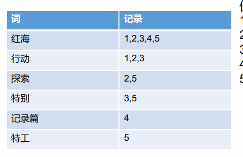
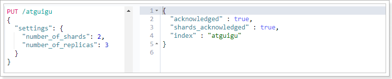
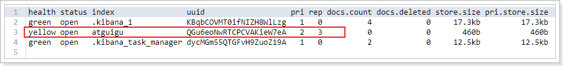
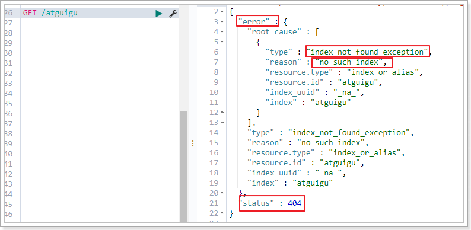
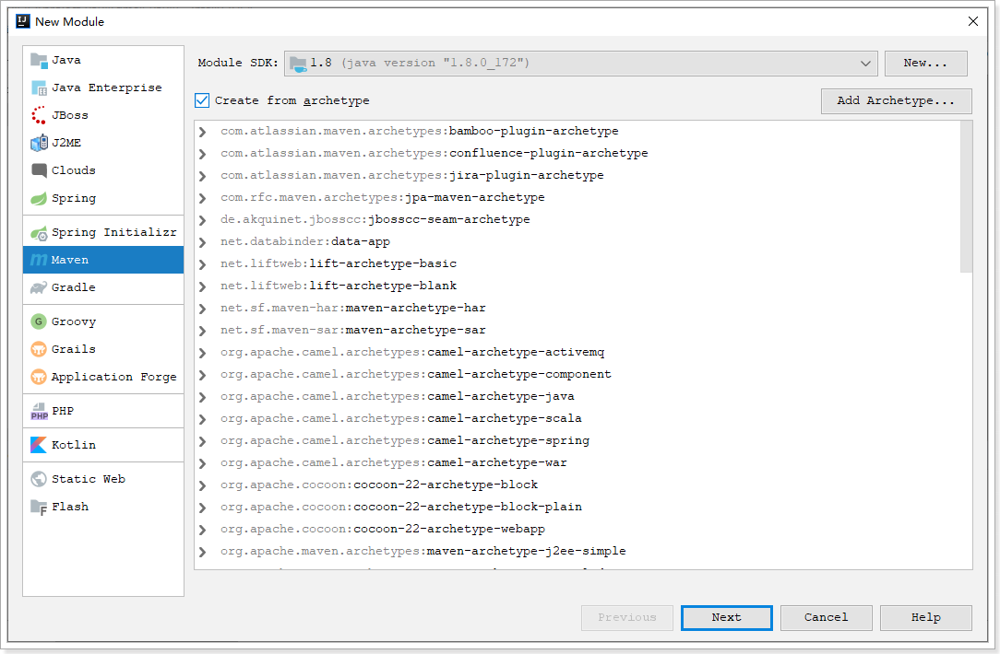

# 1. elasticsearch基本操作

简介

https://www.elastic.co/cn/what-is/elasticsearch/

全文搜索属于最常见的需求，开源的 Elasticsearch 是目前全文搜索引擎的首选。

他可以快速地存储、搜索和分析海量数据。维基百科、Stack Overflow、Github 都采用他


Elatic 的底层是开源库吧Lucene。但是，你没法直接用，必须自己写代码调用它的接口，Elastic 是 Lunce 的封装，提供了 REST API 的操作接口，开箱即用

REST API：天然的跨平台

官网文档：https://www.elastic.co/guide/en/elasticsearch/reference/current/index.html

官网中文：https://www.elastic.co/guide/cn/elasticsearch/guide/current/index.html

社区中文：

http://doc.codingdict.com/elasticsearch/

### 1.1、基本概念

#### 1.1.1 index(索引)

动词，相当于 MySQL 中的 insert；

名词，相当于MySQL 中的 DataBase

#### 1.1.2 Type(类型)

在 Index（索引）中，可以定义一个或多个类型

类似于 MySQL 中的 Table，每一种类型的数据放在一起

#### 1.1.3 Document(文档)

保存在某个索引（index）下，某种类型（Type）的一个数据（Document）,文档是 JSON 格式的，Document 就像是 MySQL 中某个 Table 里面的内容

#### 1.1.4 倒排索引机制



### 1.2 Docker 安装 ES

#### 1.2.1 下载镜像

docker pull elasticsearch:7.4.2  存储和检索数据

docker pull kibana:7.4.2 可视化检索数据	

#### 1.2.2 创建实例

##### 1、ElasticSearch

配置

```bash
mkdir -p /mydata/elasticsearch/config # 用来存放配置文件
mkdir -p /mydata/elasticsearch/data  # 数据
echo "http.host: 0.0.0.0" >/mydata/elasticsearch/config/elasticsearch.yml # 允许任何机器访问
chmod -R 777 /mydata/elasticsearch/ ## 设置elasticsearch文件可读写权限
```

启动

```bash
docker run --name elasticsearch -p 9200:9200 -p 9300:9300 \
-e  "discovery.type=single-node" \
-e ES_JAVA_OPTS="-Xms64m -Xmx512m" \
-v /mydata/elasticsearch/config/elasticsearch.yml:/usr/share/elasticsearch/config/elasticsearch.yml \
-v /mydata/elasticsearch/data:/usr/share/elasticsearch/data \
-v  /mydata/elasticsearch/plugins:/usr/share/elasticsearch/plugins \
-d elasticsearch:7.4.2 
```

开机启动 elasticsearch

```bash
docker update elasticsearch --restart=always
```

以后再外面装好插件重启就可

特别注意：

-e ES_JAVA_OPTS="-Xms64m -Xmx128m" \ 测试环境下，设置 ES 的初始内存和最大内存，否则导致过大启动不了ES

##### 2、Kibana

```bash
docker run --name kibana -e ELASTICSEARCH_HOSTS=http://192.168.56.10:9200 -p 5601:5601 -d kibana:7.4.2

http://192.168.56.10:9200 改成自己Elasticsearch上的地址
```

##### 3、安装nginx

随便启动一个 nginx 实例，只是为了复制出配置

```
docker run -p80:80 --name nginx -d nginx:1.10   
```

将容器内的配置文件拷贝到当前目录 （注意后面有个小点

）

```bash
docker container cp nginx:/etc/nginx .  
```

创建nginx文件夹

```shell
mkdir -p /mydata/nginx/html
mkdir -p /mydata/nginx/logs
 #由于拷贝完成后会在config中存在一个nginx文件夹，所以需要将它的内容移动到conf中
 #conf 文件夹下就是原先nginx的配置
mv /mydata/nginx/conf/nginx/* /mydata/nginx/conf/
rm -rf /mydata/nginx/conf/nginx
```

别忘了后面的点

修改文件名称：mv nginx.conf 把这个conf 移动到 /mydata/nginx 下

终止原容器， docker stop nginx

执行命令删除容器：docker rm $Containerid

创建新的 nginx 执行以下命令

```bash
 docker run -p 80:80 --name nginx \
 -v /mydata/nginx/html:/usr/share/nginx/html \
 -v /mydata/nginx/logs:/var/log/nginx \
 -v /mydata/nginx/conf/:/etc/nginx \
 -d nginx:1.10
```

## 1.1.   基本概念


Elasticsearch也是基于Lucene的全文检索库，本质也是存储数据，很多概念与MySQL类似的。

对比关系：

```
索引（indices）----------------------Databases 数据库

  类型（type）--------------------------Table 数据表

     文档（Document）----------------------Row 行

	    字段（Field）-------------------------Columns 列 
```


要注意的是：Elasticsearch本身就是分布式的，因此即便你只有一个节点，Elasticsearch默认也会对你的数据进行分片和副本操作，当你向集群添加新数据时，数据也会在新加入的节点中进行平衡。


## 1.2.   索引操作（indeces）

默认端口是：

### 1.2.1.    查询索引

查看es中有哪些索引库：

```
GET /_cat/indices?v
```


es 中会默认存在一个名为.kibana和.kibana_task_manager的索引

表头的含义

|     字段名     | 含义说明                                                     |
| :------------: | :----------------------------------------------------------- |
|     health     | green(集群完整) yellow(单点正常、集群不完整) red(单点不正常) |
|     status     | 是否能使用                                                   |
|     index      | 索引名                                                       |
|      uuid      | 索引统一编号                                                 |
|      pri       | 主节点几个                                                   |
|      rep       | 从节点几个                                                   |
|   docs.count   | 文档数                                                       |
|  docs.deleted  | 文档被删了多少                                               |
|   store.size   | 整体占空间大小                                               |
| pri.store.size | 主节点占                                                     |


### 1.2.2.   创建索引

```
PUT /索引名
```

参数可选：指定分片及副本，默认分片为3，副本为2。

```
{
    "settings": {
        "number_of_shards": 3,
        "number_of_replicas": 2
      }
}
```

演示：说明索引创建成功



再次查询，可以看到刚刚创建的索引：




### 1.2.3.    查看索引具体信息

```
GET /索引名
```


或者，我们可以使用*来查询所有索引具体信息


### 1.2.4.    删除索引

```
DELETE /索引库名
```

演示：


查看atguigu:




## 1.3.   映射配置（_mapping）

索引有了，接下来肯定是添加数据。但是，在添加数据之前必须定义映射。

什么是映射？

> 映射是定义文档的过程，文档包含哪些字段，这些字段是否保存，是否索引，是否分词等

只有配置清楚，Elasticsearch才会帮我们进行索引库的创建（不一定）


### 1.3.1.    创建映射字段

```
PUT /索引库名/_mapping/类型名称
{
  "properties": {
    "字段名": {
      "type": "类型",
      "index": true，
      "store": true，
      "analyzer": "分词器"
    }
  }
}
```

类型名称：就是前面将的type的概念，类似于数据库中的不同表

字段名：类似于列名，properties下可以指定许多字段。

每个字段可以有很多属性。例如：

- type：类型，可以是text、long、short、date、integer、object等
- index：是否索引，默认为true
- store：是否存储，默认为false
- analyzer：分词器，这里使用ik分词器：`ik_max_word`或者`ik_smart`


> 示例

发起请求：

```json
PUT atguigu/_mapping/goods
{
  "properties": {
    "title": {
      "type": "text",
      "analyzer": "ik_max_word"
    },
    "images": {
      "type": "keyword",
      "index": "false"
    },
    "price": {
      "type": "long"
    }
  }
}
```

响应结果：

```
{
  "acknowledged": true
}

```


### 1.3.2.    查看映射关系

> 语法：

```
GET /索引库名/_mapping
```

> 示例：

```
GET /atguigu/_mapping
```

> 响应：

```json
{
  "atguigu" : {
    "mappings" : {
      "goods" : {
        "properties" : {
          "images" : {
            "type" : "keyword",
            "index" : false
          },
          "price" : {
            "type" : "long"
          },
          "title" : {
            "type" : "text",
            "analyzer" : "ik_max_word"
          }
        }
      }
    }
  }
}
```

type：字段类型。String（text  keyword） Numeric（long integer float double） date boolean

index：是否创建索引

analyzer：分词器（ik_max_word）


## 1.4.   新增文档（document）

有了索引、类型和映射，就可以对文档做增删改查操作了。

### 1.4.1.    基本玩法

如果我们想要自己新增的时候指定id，可以这么做：

```
POST /索引库名/类型/id值
{
    ...
}
```

演示：


查询得到两条数据：小米手机的id是我们指定的id


- `_source`：源文档信息，所有的数据都在里面。
- `_id`：这条文档的唯一标示，与文档自己的id字段没有关联


### 1.4.2.    智能判断

事实上Elasticsearch非常智能，你不需要给索引库设置任何mapping映射，它也可以根据你输入的数据来判断类型，动态添加数据映射。

测试一下：

```json
POST /atguigu/goods/2
{
    "title":"小米手机",
    "images":"http://image.jd.com/12479122.jpg",
    "price":2899,
    "stock": 200,
    "saleable":true,
    "attr": {
        "category": "手机",
        "brand": "小米"
    }
}
```

我们额外添加了stock库存，saleable是否上架，attr其他属性几个字段。

来看结果：`GET /atguigu/_search`

```json
{
  "took" : 7,
  "timed_out" : false,
  "_shards" : {
    "total" : 2,
    "successful" : 2,
    "skipped" : 0,
    "failed" : 0
  },
  "hits" : {
    "total" : 2,
    "max_score" : 1.0,
    "hits" : [
      {
        "_index" : "atguigu",
        "_type" : "goods",
        "_id" : "1",
        "_score" : 1.0,
        "_source" : {
          "title" : "华为手机",
          "images" : "http://image.jd.com/12479122.jpg",
          "price" : 4288
        }
      },
      {
        "_index" : "atguigu",
        "_type" : "goods",
        "_id" : "2",
        "_score" : 1.0,
        "_source" : {
          "title" : "小米手机",
          "images" : "http://image.jd.com/12479122.jpg",
          "price" : 2899,
          "stock" : 200,
          "saleable" : true,
          "attr" : {
            "category" : "手机",
            "brand" : "小米"
          }
        }
      }
    ]
  }
}
```

再看下索引库的映射关系: `GET /atguigu/_mapping`

```json
{
  "atguigu" : {
    "mappings" : {
      "goods" : {
        "properties" : {
          "attr" : {
            "properties" : {
              "brand" : {
                "type" : "text",
                "fields" : {
                  "keyword" : {
                    "type" : "keyword",
                    "ignore_above" : 256
                  }
                }
              },
              "category" : {
                "type" : "text",
                "fields" : {
                  "keyword" : {
                    "type" : "keyword",
                    "ignore_above" : 256
                  }
                }
              }
            }
          },
          "images" : {
            "type" : "keyword",
            "index" : false
          },
          "price" : {
            "type" : "long"
          },
          "saleable" : {
            "type" : "boolean"
          },
          "stock" : {
            "type" : "long"
          },
          "title" : {
            "type" : "text",
            "analyzer" : "ik_max_word"
          }
        }
      }
    }
  }
}
```

stock，saleable，attr都被成功映射了。

如果是字符串类型的数据，会添加两种类型：text + keyword。如上例中的category 和 brand


## 1.5.   删除数据

删除使用DELETE请求，同样，需要根据id进行删除：

> 语法

```
DELETE /索引库名/类型名/id值
```

> 示例：

```
DELETE /atguigu/goods/3
```

> 结果：

```json
{
  "_index" : "atguigu",
  "_type" : "goods",
  "_id" : "3",
  "_version" : 2,
  "result" : "deleted",
  "_shards" : {
    "total" : 4,
    "successful" : 1,
    "failed" : 0
  },
  "_seq_no" : 1,
  "_primary_term" : 1
}
```


# 2. 查询

之前已经见识了查询功能

查询所有：

```
GET /{index}/_search
```

根据id查询：

```
GET /{index}/{type}/{id}
```

除了上述简单查询之外。elasticsearch作为搜索引擎，最复杂最强大的功能就是搜索查询功能。包括：匹配查询、词条查询、模糊查询、组合查询、范围查询、高亮、排序、分页等等查询功能。


基本查询语法如下：

```json
GET /索引库名/_search
{
    "query":{
        "查询类型":{
            "查询条件":"查询条件值"
        }
    }
}
```

这里的query代表一个查询对象，里面可以有不同的查询属性

- 查询类型：
  - 例如：`match_all`， `match`，`term` ， `range` 等等
- 查询条件：查询条件会根据类型的不同，写法也有差异，后面详细讲解


查询结果：

- took：查询花费时间，单位是毫秒
- time_out：是否超时
- _shards：分片信息
- hits：搜索结果总览对象
  - total：搜索到的总条数
  - max_score：所有结果中文档得分的最高分
  - hits：搜索结果的文档对象数组，每个元素是一条搜索到的文档信息
    - _index：索引库
    - _type：文档类型
    - _id：文档id
    - _score：文档得分
    - _source：文档的源数据


## 2.1.   数据准备

```json
POST /atguigu/goods/_bulk
{"index":{"_id":1}}
{ "title":"小米手机", "images":"http://image.jd.com/12479122.jpg", "price":1999, "stock": 200, "attr": { "category": "手机", "brand": "小米" } }
{"index":{"_id":2}}
{"title":"超米手机", "images":"http://image.jd.com/12479122.jpg", "price":2999, "stock": 300, "attr": { "category": "手机", "brand": "小米" } }
{"index":{"_id":3}}
{ "title":"小米电视", "images":"http://image.jd.com/12479122.jpg", "price":3999, "stock": 400, "attr": { "category": "电视", "brand": "小米" } }
{"index":{"_id":4}}
{ "title":"小米笔记本", "images":"http://image.jd.com/12479122.jpg", "price":4999, "stock": 200, "attr": { "category": "笔记本", "brand": "小米" } }
{"index":{"_id":5}}
{ "title":"华为手机", "images":"http://image.jd.com/12479122.jpg", "price":3999, "stock": 400, "attr": { "category": "手机", "brand": "华为" } }
{"index":{"_id":6}}
{ "title":"华为笔记本", "images":"http://image.jd.com/12479122.jpg", "price":5999, "stock": 200, "attr": { "category": "笔记本", "brand": "华为" } }
{"index":{"_id":7}}
{ "title":"荣耀手机", "images":"http://image.jd.com/12479122.jpg", "price":2999, "stock": 300, "attr": { "category": "手机", "brand": "华为" } }
{"index":{"_id":8}}
{ "title":"oppo手机", "images":"http://image.jd.com/12479122.jpg", "price":2799, "stock": 400, "attr": { "category": "手机", "brand": "oppo" } }
{"index":{"_id":9}}
{ "title":"vivo手机", "images":"http://image.jd.com/12479122.jpg", "price":2699, "stock": 300, "attr": { "category": "手机", "brand": "vivo" } }
{"index":{"_id":10}}
{ "title":"华为nova手机", "images":"http://image.jd.com/12479122.jpg", "price":2999, "stock": 300, "attr": { "category": "手机", "brand": "华为" } }
```


## 2.2.   匹配查询（match）

> 匹配所有

```json
GET /atguigu/_search
{
    "query":{
        "match_all": {}
    }
}
```

- `query`：代表查询对象
- `match_all`：代表查询所有


> 条件匹配

```json
GET /atguigu/_search
{
  "query": {
    "match": {
      "title": "小米手机"
    }
  }
}
```

查询出很多数据，不仅包括`小米手机`，而且与`小米`或者`手机`相关的都会查询到，说明多个词之间是`or`的关系。

某些情况下，我们需要更精确查找，我们希望这个关系变成`and`，可以这样做：

```json
GET /atguigu/_search
{
  "query": {
    "match": {
      "title": {
        "query": "小米手机",
        "operator": "and"
      }
    }
  }
}
```

查询结果：

```josn
{
  "took" : 26,
  "timed_out" : false,
  "_shards" : {
    "total" : 2,
    "successful" : 2,
    "skipped" : 0,
    "failed" : 0
  },
  "hits" : {
    "total" : 1,
    "max_score" : 1.7037868,
    "hits" : [
      {
        "_index" : "atguigu",
        "_type" : "goods",
        "_id" : "1",
        "_score" : 1.7037868,
        "_source" : {
          "title" : "小米手机",
          "images" : "http://image.jd.com/12479122.jpg",
          "price" : 1999,
          "stock" : 200,
          "attr" : {
            "category" : "手机",
            "brand" : "小米"
          }
        }
      }
    ]
  }
}
```


> 子属性匹配

```json
GET /atguigu/_search
{
  "query": {
    "match": {
      "attr.brand": "小米"
    }
  }
}
```


> 多字段匹配

`match`只能根据一个字段匹配查询，如果要根据多个字段匹配查询可以使用`multi_match`

```json
GET /atguigu/_search
{
    "query":{
        "multi_match": {
            "query": "小米",
            "fields": ["title", "attr.brand.keyword"]
        }
	}
}
```


## 2.3.   词条查询（term）

`term` 查询被用于精确值 匹配，这些精确值可能是数字、时间、布尔或者那些**未分词**的字符串。

```json
GET /atguigu/_search
{
    "query":{
        "term":{
            "price": 4999
        }
    }
}
```


## 2.4.   范围查询（range）

`range` 查询找出那些落在指定区间内的数字或者时间

```json
GET /atguigu/_search
{
    "query":{
        "range": {
            "price": {
                "gte":  1000,
                "lt":   3000
            }
    	}
    }
}
```

`range`查询允许以下字符：

| 操作符 |   说明   |
| :----: | :------: |
|   gt   |   大于   |
|  gte   | 大于等于 |
|   lt   |   小于   |
|  lte   | 小于等于 |


## 2.5.   布尔组合（bool)

布尔查询又叫**组合查询**

`bool`把各种其它查询通过`must`（与）、`must_not`（非）、`should`（或）的方式进行组合

```json
GET /atguigu/_search
{
    "query":{
        "bool":{
        	"must": [
        	  {
        	    "range": {
        	      "price": {
        	        "gte": 1000,
        	        "lte": 3000
        	      }
        	    }
        	  },
        	  {
        	    "range": {
        	      "price": {
        	        "gte": 2000,
        	        "lte": 4000
        	      }
        	    }
        	  }
        	]
        }
    }
}
```

注意：一个组合查询里面只能出现一种组合，不能混用


## 2.6.   过滤（filter）

所有的查询都会影响到文档的评分及排名。如果我们需要在查询结果中进行过滤，并且不希望过滤条件影响评分，那么就不要把过滤条件作为查询条件来用。而是使用`filter`方式：

```json
GET /atguigu/_search
{
  "query": {
    "bool": {
      "must": {
        "match": { "title": "小米手机" }
      },
      "filter": {
        "range": {
          "price": { "gt": 2000, "lt": 3000 }
        }
      }
    }
  }
}
```

注意：`filter`中还可以再次进行`bool`组合条件过滤。


## 2.7.   排序（sort）

`sort` 可以让我们按照不同的字段进行排序，并且通过`order`指定排序的方式

```json
GET /atguigu/_search
{
  "query": {
    "match": {
      "title": "小米手机"
    }
  },
  "sort": [
    {
      "price": { "order": "desc" }
    },
    {
      "_score": { "order": "desc"}
    }
  ]
}
```


## 2.8.   分页（from/size）

```json
GET /atguigu/_search
{
  "query": {
    "match": {
      "title": "小米手机"
    }
  },
  "from": 2,
  "size": 2
}
```

from：从那一条开始

size：取多少条


## 2.9.   高亮（highlight）

查看百度高亮的原理：


发现：高亮的本质是给关键字添加了<em>标签，在前端再给该标签添加样式即可。


```
GET /atguigu/_search
{
  "query": {
    "match": {
      "title": "小米"
    }
  },
  "highlight": {
    "fields": {"title": {}}, 
    "pre_tags": "<em>",
    "post_tags": "</em>"
  }
}
```

fields：高亮字段

pre_tags：前置标签

post_tags：后置标签

查询结果如下：


## 2.10.   结果过滤（_source）

默认情况下，elasticsearch在搜索的结果中，会把文档中保存在`_source`的所有字段都返回。

如果我们只想获取其中的部分字段，可以添加`_source`的过滤

```json
GET /atguigu/_search
{
  "_source": ["title","price"],
  "query": {
    "term": {
      "price": 2699
    }
  }
}
```

返回结果，只有两个字段：

```
{
  "took" : 9,
  "timed_out" : false,
  "_shards" : {
    "total" : 2,
    "successful" : 2,
    "skipped" : 0,
    "failed" : 0
  },
  "hits" : {
    "total" : 1,
    "max_score" : 1.0,
    "hits" : [
      {
        "_index" : "atguigu",
        "_type" : "goods",
        "_id" : "9",
        "_score" : 1.0,
        "_source" : {
          "price" : 2699,
          "title" : "vivo手机"
        }
      }
    ]
  }
}
```


# 3. 聚合（aggregations）

聚合可以让我们极其方便的实现对数据的统计、分析。例如：

- 什么品牌的手机最受欢迎？
- 这些手机的平均价格、最高价格、最低价格？
- 这些手机每月的销售情况如何？

实现这些统计功能的比数据库的sql要方便的多，而且查询速度非常快，可以实现实时搜索效果。


## 3.1 基本概念

Elasticsearch中的聚合，包含多种类型，最常用的两种，一个叫`桶`，一个叫`度量`：

> **桶（bucket）**

桶的作用，是按照某种方式对数据进行分组，每一组数据在ES中称为一个`桶`，例如我们根据国籍对人划分，可以得到`中国桶`、`英国桶`，`日本桶`……或者我们按照年龄段对人进行划分：0~10,10~20,20~30,30~40等。

Elasticsearch中提供的划分桶的方式有很多：

- Date Histogram Aggregation：根据日期阶梯分组，例如给定阶梯为周，会自动每周分为一组
- Histogram Aggregation：根据数值阶梯分组，与日期类似
- Terms Aggregation：根据词条内容分组，词条内容完全匹配的为一组
- Range Aggregation：数值和日期的范围分组，指定开始和结束，然后按段分组
- ……


bucket aggregations 只负责对数据进行分组，并不进行计算，因此往往bucket中往往会嵌套另一种聚合：metrics aggregations即度量


> **度量（metrics）**

分组完成以后，我们一般会对组中的数据进行聚合运算，例如求平均值、最大、最小、求和等，这些在ES中称为`度量`

比较常用的一些度量聚合方式：

- Avg Aggregation：求平均值
- Max Aggregation：求最大值
- Min Aggregation：求最小值
- Percentiles Aggregation：求百分比
- Stats Aggregation：同时返回avg、max、min、sum、count等
- Sum Aggregation：求和
- Top hits Aggregation：求前几
- Value Count Aggregation：求总数
- ……


## 3.2 聚合为桶

首先，我们按照手机的品牌`attr.brand.keyword`来划分`桶`

```json
GET /atguigu/_search
{
    "size" : 0,
    "aggs" : { 
        "brands" : { 
            "terms" : { 
              "field" : "attr.brand.keyword"
            }
        }
    }
}
```

- size： 查询条数，这里设置为0，因为我们不关心搜索到的数据，只关心聚合结果，提高效率
- aggs：声明这是一个聚合查询，是aggregations的缩写
  - brands：给这次聚合起一个名字，任意。
    - terms：划分桶的方式，这里是根据词条划分
      - field：划分桶的字段

结果：

```json
{
  "took" : 124,
  "timed_out" : false,
  "_shards" : {
    "total" : 2,
    "successful" : 2,
    "skipped" : 0,
    "failed" : 0
  },
  "hits" : {
    "total" : 10,
    "max_score" : 0.0,
    "hits" : [ ]
  },
  "aggregations" : {
    "brands" : {
      "doc_count_error_upper_bound" : 0,
      "sum_other_doc_count" : 0,
      "buckets" : [
        {
          "key" : "华为",
          "doc_count" : 4
        },
        {
          "key" : "小米",
          "doc_count" : 4
        },
        {
          "key" : "oppo",
          "doc_count" : 1
        },
        {
          "key" : "vivo",
          "doc_count" : 1
        }
      ]
    }
  }
}
```

- hits：查询结果为空，因为我们设置了size为0
- aggregations：聚合的结果
- brands：我们定义的聚合名称
- buckets：查找到的桶，每个不同的品牌字段值都会形成一个桶
  - key：这个桶对应的品牌字段的值
  - doc_count：这个桶中的文档数量


## 3.3 桶内度量

前面的例子告诉我们每个桶里面的文档数量，这很有用。 但通常，我们的应用需要提供更复杂的文档度量。 例如，每种品牌手机的平均价格是多少？

因此，我们需要告诉Elasticsearch`使用哪个字段`，`使用何种度量方式`进行运算，这些信息要嵌套在`桶`内，`度量`的运算会基于`桶`内的文档进行

现在，我们为刚刚的聚合结果添加 求价格平均值的度量：

```json
GET /atguigu/_search
{
    "size" : 0,
    "aggs" : { 
        "brands" : { 
            "terms" : { 
              "field" : "attr.brand.keyword"
            },
            "aggs":{
                "avg_price": { 
                   "avg": {
                      "field": "price" 
                   }
                }
            }
        }
    }
}
```

- aggs：我们在上一个aggs(brands)中添加新的aggs。可见`度量`也是一个聚合
- avg_price：聚合的名称
- avg：度量的类型，这里是求平均值
- field：度量运算的字段


结果：

```json
{
  "took" : 41,
  "timed_out" : false,
  "_shards" : {
    "total" : 2,
    "successful" : 2,
    "skipped" : 0,
    "failed" : 0
  },
  "hits" : {
    "total" : 10,
    "max_score" : 0.0,
    "hits" : [ ]
  },
  "aggregations" : {
    "brands" : {
      "doc_count_error_upper_bound" : 0,
      "sum_other_doc_count" : 0,
      "buckets" : [
        {
          "key" : "华为",
          "doc_count" : 4,
          "avg_price" : {
            "value" : 3999.0
          }
        },
        {
          "key" : "小米",
          "doc_count" : 4,
          "avg_price" : {
            "value" : 3499.0
          }
        },
        {
          "key" : "oppo",
          "doc_count" : 1,
          "avg_price" : {
            "value" : 2799.0
          }
        },
        {
          "key" : "vivo",
          "doc_count" : 1,
          "avg_price" : {
            "value" : 2699.0
          }
        }
      ]
    }
  }
}

```

可以看到每个桶中都有自己的`avg_price`字段，这是度量聚合的结果


## 3.4 桶内嵌套桶

刚刚的案例中，我们在桶内嵌套度量运算。事实上桶不仅可以嵌套运算， 还可以再嵌套其它桶。也就是说在每个分组中，再分更多组。

比如：我们想统计每个品牌都生产了那些产品，按照`attr.category.keyword`字段再进行分桶

```json
GET /atguigu/_search
{
    "size" : 0,
    "aggs" : { 
        "brands" : { 
            "terms" : { 
              "field" : "attr.brand.keyword"
            },
            "aggs":{
                "avg_price": { 
                   "avg": {
                      "field": "price" 
                   }
                },
                "categorys": {
                  "terms": {
                    "field": "attr.category.keyword"
                  }
                }
            }
        }
    }
}
```


部分结果：

```json
{
  "took" : 19,
  "timed_out" : false,
  "_shards" : {
    "total" : 2,
    "successful" : 2,
    "skipped" : 0,
    "failed" : 0
  },
  "hits" : {
    "total" : 10,
    "max_score" : 0.0,
    "hits" : [ ]
  },
  "aggregations" : {
    "brands" : {
      "doc_count_error_upper_bound" : 0,
      "sum_other_doc_count" : 0,
      "buckets" : [
        {
          "key" : "华为",
          "doc_count" : 4,
          "categorys" : {
            "doc_count_error_upper_bound" : 0,
            "sum_other_doc_count" : 0,
            "buckets" : [
              {
                "key" : "手机",
                "doc_count" : 3
              },
              {
                "key" : "笔记本",
                "doc_count" : 1
              }
            ]
          },
          "avg_price" : {
            "value" : 3999.0
          }
        },
        {
          "key" : "小米",
          "doc_count" : 4,
          "categorys" : {
            "doc_count_error_upper_bound" : 0,
            "sum_other_doc_count" : 0,
            "buckets" : [
              {
                "key" : "手机",
                "doc_count" : 2
              },
              {
                "key" : "电视",
                "doc_count" : 1
              },
              {
                "key" : "笔记本",
                "doc_count" : 1
              }
            ]
          },
          "avg_price" : {
            "value" : 3499.0
          }
        },
        {
          "key" : "oppo",
          "doc_count" : 1,
          "categorys" : {
            "doc_count_error_upper_bound" : 0,
            "sum_other_doc_count" : 0,
            "buckets" : [
              {
                "key" : "手机",
                "doc_count" : 1
              }
            ]
          },
          "avg_price" : {
            "value" : 2799.0
          }
        },
        {
          "key" : "vivo",
          "doc_count" : 1,
          "categorys" : {
            "doc_count_error_upper_bound" : 0,
            "sum_other_doc_count" : 0,
            "buckets" : [
              {
                "key" : "手机",
                "doc_count" : 1
              }
            ]
          },
          "avg_price" : {
            "value" : 2699.0
          }
        }
      ]
    }
  }
}

```

- 我们可以看到，新的聚合`categorys`被嵌套在原来每一个`brands`的桶中。
- 每个品牌下面都根据 `attr.category.keyword`字段进行了分组
- 我们能读取到的信息：
  - 华为有4中产品
  - 华为产品的平均售价是 3999.0美元。
  - 其中3种手机产品，1种笔记本产品


# 4. SpringData-Elasticsearch

目前市面上有两类客户端

一类是TransportClient 为代表的ES原生客户端，不能执行原生dsl语句必须使用它的Java api方法。

另外一种是以Rest Api为主的missing client，最典型的就是jest。 这种客户端可以直接使用dsl语句拼成的字符串，直接传给服务端，然后返回json字符串再解析。

两种方式各有优劣，但是最近elasticsearch官网，宣布计划在7.0以后的版本中废除TransportClient。以RestClient为主。


由于原生的Elasticsearch客户端API非常麻烦。所以这里直接学习Spring提供的套件：Spring Data Elasticsearch。


**spring-data-Elasticsearch 使用之前,必须先确定版本,elasticsearch 对版本的要求比较高。**


## 4.1.   创建module

在gmall工程下创建一个模块：




 

引入依赖：

```xml
<dependency>
    <groupId>org.springframework.boot</groupId>
    <artifactId>spring-boot-starter-data-elasticsearch</artifactId>
    <exclusions>
        <exclusion>
            <groupId>org.elasticsearch.client</groupId>
            <artifactId>elasticsearch-rest-high-level-client</artifactId>
        </exclusion>
        <exclusion>
            <groupId>org.elasticsearch.client</groupId>
            <artifactId>transport</artifactId>
        </exclusion>
    </exclusions>
</dependency>
<dependency>
    <groupId>org.elasticsearch.client</groupId>
    <artifactId>elasticsearch-rest-high-level-client</artifactId>
    <version>6.8.1</version>
</dependency>
<dependency>
    <groupId>org.elasticsearch.client</groupId>
    <artifactId>transport</artifactId>
    <version>6.8.1</version>
</dependency>
<dependency>
    <groupId>org.projectlombok</groupId>
    <artifactId>lombok</artifactId>
    <version>1.18.10</version>
</dependency>
```


在application.properties中添加配置

```properties
spring.elasticsearch.rest.uris=http://172.16.116.100:9200
# 集群情况下
spring.elasticsearch.rest.uris[0]=http://172.16.116.100:9200
spring.elasticsearch.rest.uris[1]=http://172.16.116.100:9200
```


## 4.2.   实体类

```java
@Data
@AllArgsConstructor
@NoArgsConstructor
@Document(indexName = "user", type = "info", shards = 3, replicas = 2)
public class User {
    @Id
    private Long id;
    @Field(type = FieldType.Text, analyzer = "ik_max_word")
    private String name;
    @Field(type = FieldType.Integer)
    private Integer age;
    @Field(type = FieldType.Keyword)
    private String password;
}
```

Spring Data通过注解来声明字段的映射属性，有下面的三个注解：

- `@Document` 作用在类，标记实体类为文档对象，一般有四个属性
  - indexName：对应索引库名称
  - type：对应在索引库中的类型
  - shards：分片数量，默认5
  - replicas：副本数量，默认1
- `@Id` 作用在成员变量，标记一个字段作为id主键
- `@Field` 作用在成员变量，标记为文档的字段，并指定字段映射属性：
  - type：字段类型，取值是枚举：FieldType
  - index：是否索引，布尔类型，默认是true
  - store：是否存储，布尔类型，默认是false
  - analyzer：分词器名称：ik_max_word


## 4.3.   创建索引及映射

```java
@SpringBootTest
class EsDemoApplicationTests {

    // ElasticsearchTemplate是TransportClient客户端
    // ElasticsearchRestTemplate是RestHighLevel客户端
    @Autowired
    ElasticsearchRestTemplate restTemplate;

    @Test
    void contextLoads() {
        // 创建索引
        this.restTemplate.createIndex(User.class);
        // 创建映射
        this.restTemplate.putMapping(User.class);
        // 删除索引
        // this.restTemplate.deleteIndex("user");
    }

}
```


## 4.4.   Repository文档操作

Spring Data 的强大之处，就在于你不用写任何DAO处理，自动根据方法名或类的信息进行CRUD操作。只要你定义一个接口，然后继承Repository提供的一些子接口，就能具备各种基本的CRUD功能。

 

其中ElasticsearchRepository接口功能最强大。该接口的方法包括：


### 4.4.1.   新增

```java
@Autowired
UserRepository userRepository;

@Test
void testAdd(){
    this.userRepository.save(new User(1l, "zhang3", 20, "123456"));
}
```

修改和新增是同一个接口，区分的依据就是id，这一点跟我们在页面发起PUT请求是类似的。


### 4.4.2.   删除

```java
@Test
void testDelete(){
    this.userRepository.deleteById(1l);
}
```


## 4.5.   查询

### 4.5.1.   基本查询


查询一个：

```java
@Test
void testFind(){
    System.out.println(this.userRepository.findById(1l).get());
}
```


### 4.5.2.   条件查询

Spring Data 的另一个强大功能，是根据方法名称自动实现功能。

比如：你的方法名叫做：findByTitle，那么它就知道你是根据title查询，然后自动帮你完成，无需写实现类。

当然，方法名称要符合一定的约定：

| Keyword               | Sample                                     | Elasticsearch Query String                                   |
| --------------------- | ------------------------------------------ | ------------------------------------------------------------ |
| `And`                 | `findByNameAndPrice`                       | `{"bool" : {"must" : [ {"field" : {"name" : "?"}}, {"field" : {"price" : "?"}} ]}}` |
| `Or`                  | `findByNameOrPrice`                        | `{"bool" : {"should" : [ {"field" : {"name" : "?"}}, {"field" : {"price" : "?"}} ]}}` |
| `Is`                  | `findByName`                               | `{"bool" : {"must" : {"field" : {"name" : "?"}}}}`           |
| `Not`                 | `findByNameNot`                            | `{"bool" : {"must_not" : {"field" : {"name" : "?"}}}}`       |
| `Between`             | `findByPriceBetween`                       | `{"bool" : {"must" : {"range" : {"price" : {"from" : ?,"to" : ?,"include_lower" : true,"include_upper" : true}}}}}` |
| `LessThanEqual`       | `findByPriceLessThan`                      | `{"bool" : {"must" : {"range" : {"price" : {"from" : null,"to" : ?,"include_lower" : true,"include_upper" : true}}}}}` |
| `GreaterThanEqual`    | `findByPriceGreaterThan`                   | `{"bool" : {"must" : {"range" : {"price" : {"from" : ?,"to" : null,"include_lower" : true,"include_upper" : true}}}}}` |
| `Before`              | `findByPriceBefore`                        | `{"bool" : {"must" : {"range" : {"price" : {"from" : null,"to" : ?,"include_lower" : true,"include_upper" : true}}}}}` |
| `After`               | `findByPriceAfter`                         | `{"bool" : {"must" : {"range" : {"price" : {"from" : ?,"to" : null,"include_lower" : true,"include_upper" : true}}}}}` |
| `Like`                | `findByNameLike`                           | `{"bool" : {"must" : {"field" : {"name" : {"query" : "?*","analyze_wildcard" : true}}}}}` |
| `StartingWith`        | `findByNameStartingWith`                   | `{"bool" : {"must" : {"field" : {"name" : {"query" : "?*","analyze_wildcard" : true}}}}}` |
| `EndingWith`          | `findByNameEndingWith`                     | `{"bool" : {"must" : {"field" : {"name" : {"query" : "*?","analyze_wildcard" : true}}}}}` |
| `Contains/Containing` | `findByNameContaining`                     | `{"bool" : {"must" : {"field" : {"name" : {"query" : "**?**","analyze_wildcard" : true}}}}}` |
| `In`                  | `findByNameIn(Collection<String>names)`    | `{"bool" : {"must" : {"bool" : {"should" : [ {"field" : {"name" : "?"}}, {"field" : {"name" : "?"}} ]}}}}` |
| `NotIn`               | `findByNameNotIn(Collection<String>names)` | `{"bool" : {"must_not" : {"bool" : {"should" : {"field" : {"name" : "?"}}}}}}` |
| `Near`                | `findByStoreNear`                          | `Not Supported Yet !`                                        |
| `True`                | `findByAvailableTrue`                      | `{"bool" : {"must" : {"field" : {"available" : true}}}}`     |
| `False`               | `findByAvailableFalse`                     | `{"bool" : {"must" : {"field" : {"available" : false}}}}`    |
| `OrderBy`             | `findByAvailableTrueOrderByNameDesc`       | `{"sort" : [{ "name" : {"order" : "desc"} }],"bool" : {"must" : {"field" : {"available" : true}}}}` |

准备一组数据：

```java
@Test
void testAddAll(){
    List<User> users = new ArrayList<>();
    users.add(new User(1l, "柳岩", 18, "123456"));
    users.add(new User(2l, "范冰冰", 19, "123456"));
    users.add(new User(3l, "李冰冰", 20, "123456"));
    users.add(new User(4l, "锋哥", 21, "123456"));
    users.add(new User(5l, "小鹿", 22, "123456"));
    users.add(new User(6l, "韩红", 23, "123456"));
    this.userRepository.saveAll(users);
}
```


在UserRepository中定义一个方法：

第一种写法：

```java
public interface UserRepository extends ElasticsearchRepository<User, Long> {

    /**
     * 根据年龄区间查询
     * @param age1
     * @param age2
     * @return
     */
    List<User> findByAgeBetween(Integer age1, Integer age2);
}
```

测试：

```java
@Test
void testFindByAgeBetween(){
    System.out.println(this.userRepository.findByAgeBetween(20, 30));
}
```


第二种写法：

```java
@Query("{\n" +
       "    \"range\": {\n" +
       "      \"age\": {\n" +
       "        \"gte\": \"?0\",\n" +
       "        \"lte\": \"?1\"\n" +
       "      }\n" +
       "    }\n" +
       "  }")
List<User> findByQuery(Integer age1, Integer age2);
```

测试：

```java
@Test
void testFindByQuery(){
	System.out.println(this.userRepository.findByQuery(20, 30));
}
```


### 4.5.3.   自定义查询

```java
@Test
void testNative(){
    // 初始化自定义查询对象
    NativeSearchQueryBuilder queryBuilder = new NativeSearchQueryBuilder();
    // 构建查询
    queryBuilder.withQuery(QueryBuilders.matchQuery("name", "冰冰"));
    // 排序
    queryBuilder.withSort(SortBuilders.fieldSort("age").order(SortOrder.ASC));
    // 分页
    queryBuilder.withPageable(PageRequest.of(0, 2));
    // 高亮
    queryBuilder.withHighlightBuilder(new HighlightBuilder().field("name").preTags("<em>").postTags("</em>"));
    // 执行查询，获取分页结果集
    Page<User> userPage = this.userRepository.search(queryBuilder.build());
    // 总页数
    System.out.println(userPage.getTotalPages());
    // 总记录数
    System.out.println(userPage.getTotalElements());
    // 当前页数据
    System.out.println(userPage.getContent());
}
```

NativeSearchQueryBuilder：Spring提供的一个查询条件构建器，帮助构建json格式的请求体

`Page<item>`：默认是分页查询，因此返回的是一个分页的结果对象，包含属性：

- totalElements：总条数
- totalPages：总页数
- Iterator：迭代器，本身实现了Iterator接口，因此可直接迭代得到当前页的数据


### 3）Mapping

##### （1）字段类型


##### （2）映射

Mapping(映射)
Maping是用来定义一个文档（document），以及它所包含的属性（field）是如何存储和索引的。比如：使用maping来定义：

* 哪些字符串属性应该被看做全文本属性（full text fields）；
* 哪些属性包含数字，日期或地理位置；
* 文档中的所有属性是否都嫩被索引（all 配置）；
* 日期的格式；
* 自定义映射规则来执行动态添加属性；

* 查看mapping信息
  GET bank/_mapping

  

  ```json
  {
    "bank" : {
      "mappings" : {
        "properties" : {
          "account_number" : {
            "type" : "long"
          },
          "address" : {
            "type" : "text",
            "fields" : {
              "keyword" : {
                "type" : "keyword",
                "ignore_above" : 256
              }
            }
          },
          "age" : {
            "type" : "long"
          },
          "balance" : {
            "type" : "long"
          },
          "city" : {
            "type" : "text",
            "fields" : {
              "keyword" : {
                "type" : "keyword",
                "ignore_above" : 256
              }
            }
          },
          "email" : {
            "type" : "text",
            "fields" : {
              "keyword" : {
                "type" : "keyword",
                "ignore_above" : 256
              }
            }
          },
          "employer" : {
            "type" : "text",
            "fields" : {
              "keyword" : {
                "type" : "keyword",
                "ignore_above" : 256
              }
            }
          },
          "firstname" : {
            "type" : "text",
            "fields" : {
              "keyword" : {
                "type" : "keyword",
                "ignore_above" : 256
              }
            }
          },
          "gender" : {
            "type" : "text",
            "fields" : {
              "keyword" : {
                "type" : "keyword",
                "ignore_above" : 256
              }
            }
          },
          "lastname" : {
            "type" : "text",
            "fields" : {
              "keyword" : {
                "type" : "keyword",
                "ignore_above" : 256
              }
            }
          },
          "state" : {
            "type" : "text",
            "fields" : {
              "keyword" : {
                "type" : "keyword",
                "ignore_above" : 256
              }
            }
          }
        }
      }
    }
  }
  ```

  

* 修改mapping信息


##### （3）新版本改变

ElasticSearch7-去掉type概念

1. 关系型数据库中两个数据表示是独立的，即使他们里面有相同名称的列也不影响使用，但ES中不是这样的。elasticsearch是基于Lucene开发的搜索引擎，而ES中不同type下名称相同的filed最终在Lucene中的处理方式是一样的。

   - 两个不同type下的两个user_name，在ES同一个索引下其实被认为是同一个filed，你必须在两个不同的type中定义相同的filed映射。否则，不同type中的相同字段名称就会在处理中出现冲突的情况，导致Lucene处理效率下降。
   - 去掉type就是为了提高ES处理数据的效率。

2. Elasticsearch 7.x URL中的type参数为可选。比如，索引一个文档不再要求提供文档类型。

3. Elasticsearch 8.x 不再支持URL中的type参数。

4. 解决：
   将索引从多类型迁移到单类型，每种类型文档一个独立索引

   将已存在的索引下的类型数据，全部迁移到指定位置即可。详见数据迁移


>
>
>**Elasticsearch 7.x**
>
>- Specifying types in requests is deprecated. For instance, indexing a document no longer requires a document `type`. The new index APIs are `PUT {index}/_doc/{id}` in case of explicit ids and `POST {index}/_doc` for auto-generated ids. Note that in 7.0, `_doc` is a permanent part of the path, and represents the endpoint name rather than the document type.
>- The `include_type_name` parameter in the index creation, index template, and mapping APIs will default to `false`. Setting the parameter at all will result in a deprecation warning.
>- The `_default_` mapping type is removed.
>
>**Elasticsearch 8.x**
>
>- Specifying types in requests is no longer supported.
>- The `include_type_name` parameter is removed.


###### 创建映射

创建索引并指定映射

```json
PUT /my_index
{
  "mappings": {
    "properties": {
      "age": {
        "type": "integer"
      },
      "email": {
        "type": "keyword"
      },
      "name": {
        "type": "text"
      }
    }
  }
}
```

 输出：

```json
{
  "acknowledged" : true,
  "shards_acknowledged" : true,
  "index" : "my_index"
}

```


###### 查看映射

```json
GET /my_index
```

输出结果：

```json
{
  "my_index" : {
    "aliases" : { },
    "mappings" : {
      "properties" : {
        "age" : {
          "type" : "integer"
        },
        "email" : {
          "type" : "keyword"
        },
        "employee-id" : {
          "type" : "keyword",
          "index" : false
        },
        "name" : {
          "type" : "text"
        }
      }
    },
    "settings" : {
      "index" : {
        "creation_date" : "1588410780774",
        "number_of_shards" : "1",
        "number_of_replicas" : "1",
        "uuid" : "ua0lXhtkQCOmn7Kh3iUu0w",
        "version" : {
          "created" : "7060299"
        },
        "provided_name" : "my_index"
      }
    }
  }
}
```


###### 添加新的字段映射

```json
PUT /my_index/_mapping
{
  "properties": {
    "employee-id": {
      "type": "keyword",
      "index": false
    }
  }
}
```

这里的 "index": false，表明新增的字段不能被检索，只是一个冗余字段。


###### 更新映射

对于已经存在的字段映射，我们不能更新。更新必须创建新的索引，进行数据迁移。

###### 数据迁移

先创建new_twitter的正确映射。然后使用如下方式进行数据迁移。

```json
POST reindex [固定写法]
{
  "source":{
      "index":"twitter"
   },
  "dest":{
      "index":"new_twitters"
   }
}
```


将旧索引的type下的数据进行迁移

```json
POST reindex [固定写法]
{
  "source":{
      "index":"twitter",
      "twitter":"twitter"
   },
  "dest":{
      "index":"new_twitters"
   }
}
```

更多详情见： https://www.elastic.co/guide/en/elasticsearch/reference/7.6/docs-reindex.html 


GET /bank/_search

```json
{
  "took" : 0,
  "timed_out" : false,
  "_shards" : {
    "total" : 1,
    "successful" : 1,
    "skipped" : 0,
    "failed" : 0
  },
  "hits" : {
    "total" : {
      "value" : 1000,
      "relation" : "eq"
    },
    "max_score" : 1.0,
    "hits" : [
      {
        "_index" : "bank",
        "_type" : "account",//类型为account
        "_id" : "1",
        "_score" : 1.0,
        "_source" : {
          "account_number" : 1,
          "balance" : 39225,
          "firstname" : "Amber",
          "lastname" : "Duke",
          "age" : 32,
          "gender" : "M",
          "address" : "880 Holmes Lane",
          "employer" : "Pyrami",
          "email" : "amberduke@pyrami.com",
          "city" : "Brogan",
          "state" : "IL"
        }
      },
      ...
```


```
GET /bank/_search
```


想要将年龄修改为integer

```json
PUT /newbank
{
  "mappings": {
    "properties": {
      "account_number": {
        "type": "long"
      },
      "address": {
        "type": "text"
      },
      "age": {
        "type": "integer"
      },
      "balance": {
        "type": "long"
      },
      "city": {
        "type": "keyword"
      },
      "email": {
        "type": "keyword"
      },
      "employer": {
        "type": "keyword"
      },
      "firstname": {
        "type": "text"
      },
      "gender": {
        "type": "keyword"
      },
      "lastname": {
        "type": "text",
        "fields": {
          "keyword": {
            "type": "keyword",
            "ignore_above": 256
          }
        }
      },
      "state": {
        "type": "keyword"
      }
    }
  }
}
```

查看“newbank”的映射：

GET /newbank/_mapping


能够看到age的映射类型被修改为了integer.


将bank中的数据迁移到newbank中

```json
POST _reindex
{
  "source": {
    "index": "bank",
    "type": "account"
  },
  "dest": {
    "index": "newbank"
  }
}
```

运行输出：

```json
#! Deprecation: [types removal] Specifying types in reindex requests is deprecated.
{
  "took" : 768,
  "timed_out" : false,
  "total" : 1000,
  "updated" : 0,
  "created" : 1000,
  "deleted" : 0,
  "batches" : 1,
  "version_conflicts" : 0,
  "noops" : 0,
  "retries" : {
    "bulk" : 0,
    "search" : 0
  },
  "throttled_millis" : 0,
  "requests_per_second" : -1.0,
  "throttled_until_millis" : 0,
  "failures" : [ ]
}
```


查看newbank中的数据


#### 4）分词

一个tokenizer（分词器）接收一个字符流，将之分割为独立的tokens（词元，通常是独立的单词），然后输出tokens流。

例如：whitespace tokenizer遇到空白字符时分割文本。它会将文本“Quick brown fox!”分割为[Quick,brown,fox!]。

该tokenizer（分词器）还负责记录各个terms(词条)的顺序或position位置（用于phrase短语和word proximity词近邻查询），以及term（词条）所代表的原始word（单词）的start（起始）和end（结束）的character offsets（字符串偏移量）（用于高亮显示搜索的内容）。

elasticsearch提供了很多内置的分词器，可以用来构建custom analyzers（自定义分词器）。

关于分词器： https://www.elastic.co/guide/en/elasticsearch/reference/7.6/analysis.html 


```json
POST _analyze
{
  "analyzer": "standard",
  "text": "The 2 QUICK Brown-Foxes jumped over the lazy dog's bone."
}
```

执行结果：

```json
{
  "tokens" : [
    {
      "token" : "the",
      "start_offset" : 0,
      "end_offset" : 3,
      "type" : "<ALPHANUM>",
      "position" : 0
    },
    {
      "token" : "2",
      "start_offset" : 4,
      "end_offset" : 5,
      "type" : "<NUM>",
      "position" : 1
    },
    {
      "token" : "quick",
      "start_offset" : 6,
      "end_offset" : 11,
      "type" : "<ALPHANUM>",
      "position" : 2
    },
    {
      "token" : "brown",
      "start_offset" : 12,
      "end_offset" : 17,
      "type" : "<ALPHANUM>",
      "position" : 3
    },
    {
      "token" : "foxes",
      "start_offset" : 18,
      "end_offset" : 23,
      "type" : "<ALPHANUM>",
      "position" : 4
    },
    {
      "token" : "jumped",
      "start_offset" : 24,
      "end_offset" : 30,
      "type" : "<ALPHANUM>",
      "position" : 5
    },
    {
      "token" : "over",
      "start_offset" : 31,
      "end_offset" : 35,
      "type" : "<ALPHANUM>",
      "position" : 6
    },
    {
      "token" : "the",
      "start_offset" : 36,
      "end_offset" : 39,
      "type" : "<ALPHANUM>",
      "position" : 7
    },
    {
      "token" : "lazy",
      "start_offset" : 40,
      "end_offset" : 44,
      "type" : "<ALPHANUM>",
      "position" : 8
    },
    {
      "token" : "dog's",
      "start_offset" : 45,
      "end_offset" : 50,
      "type" : "<ALPHANUM>",
      "position" : 9
    },
    {
      "token" : "bone",
      "start_offset" : 51,
      "end_offset" : 55,
      "type" : "<ALPHANUM>",
      "position" : 10
    }
  ]
}

```


##### （1）安装ik分词器


所有的语言分词，默认使用的都是“Standard Analyzer”，但是这些分词器针对于中文的分词，并不友好。为此需要安装中文的分词器。


注意：不能用默认elasticsearch-plugin install xxx.zip 进行自动安装
https://github.com/medcl/elasticsearch-analysis-ik/releases/download 对应es版本安装


在前面安装的elasticsearch时，我们已经将elasticsearch容器的“/usr/share/elasticsearch/plugins”目录，映射到宿主机的“ /mydata/elasticsearch/plugins”目录下，所以比较方便的做法就是下载“/elasticsearch-analysis-ik-7.6.2.zip”文件，然后解压到该文件夹下即可。安装完毕后，需要重启elasticsearch容器。

 

如果不嫌麻烦，还可以采用如下的方式。

###### （1）查看elasticsearch版本号：

```shell
[root@hadoop-104 ~]# curl http://localhost:9200
{
  "name" : "0adeb7852e00",
  "cluster_name" : "elasticsearch",
  "cluster_uuid" : "9gglpP0HTfyOTRAaSe2rIg",
  "version" : {
    "number" : "7.6.2",      #版本号为7.6.2
    "build_flavor" : "default",
    "build_type" : "docker",
    "build_hash" : "ef48eb35cf30adf4db14086e8aabd07ef6fb113f",
    "build_date" : "2020-03-26T06:34:37.794943Z",
    "build_snapshot" : false,
    "lucene_version" : "8.4.0",
    "minimum_wire_compatibility_version" : "6.8.0",
    "minimum_index_compatibility_version" : "6.0.0-beta1"
  },
  "tagline" : "You Know, for Search"
}
[root@hadoop-104 ~]# 
```


###### （2）进入es容器内部plugin目录

* docker exec -it 容器id /bin/bash

```shell
[root@hadoop-104 ~]# docker exec -it elasticsearch /bin/bash
[root@0adeb7852e00 elasticsearch]# 
```

* wget  https://github.com/medcl/elasticsearch-analysis-ik/releases/download/v7.6.2/elasticsearch-analysis-ik-7.6.2.zip

```shell
[root@0adeb7852e00 elasticsearch]# pwd
/usr/share/elasticsearch
#下载ik7.6.2
[root@0adeb7852e00 elasticsearch]# wget https://github.com/medcl/elasticsearch-analysis-ik/releases/download/v7.6.2/elasticsearch-analysis-ik-7.6.2.zip
```

* unzip 下载的文件

```shell
[root@0adeb7852e00 elasticsearch]# unzip elasticsearch-analysis-ik-7.6.2.zip -d ink
Archive:  elasticsearch-analysis-ik-7.6.2.zip
   creating: ik/config/
  inflating: ik/config/main.dic      
  inflating: ik/config/quantifier.dic  
  inflating: ik/config/extra_single_word_full.dic  
  inflating: ik/config/IKAnalyzer.cfg.xml  
  inflating: ik/config/surname.dic   
  inflating: ik/config/suffix.dic    
  inflating: ik/config/stopword.dic  
  inflating: ik/config/extra_main.dic  
  inflating: ik/config/extra_stopword.dic  
  inflating: ik/config/preposition.dic  
  inflating: ik/config/extra_single_word_low_freq.dic  
  inflating: ik/config/extra_single_word.dic  
  inflating: ik/elasticsearch-analysis-ik-7.6.2.jar  
  inflating: ik/httpclient-4.5.2.jar  
  inflating: ik/httpcore-4.4.4.jar   
  inflating: ik/commons-logging-1.2.jar  
  inflating: ik/commons-codec-1.9.jar  
  inflating: ik/plugin-descriptor.properties  
  inflating: ik/plugin-security.policy  
[root@0adeb7852e00 elasticsearch]#
#移动到plugins目录下
[root@0adeb7852e00 elasticsearch]# mv ik plugins/
```

* rm -rf *.zip

```
[root@0adeb7852e00 elasticsearch]# rm -rf elasticsearch-analysis-ik-7.6.2.zip 
```


确认是否安装好了分词器

##### （2）测试分词器

使用默认

```json
GET my_index/_analyze
{
   "text":"我是中国人"
}
```

请观察执行结果：

```json
{
  "tokens" : [
    {
      "token" : "我",
      "start_offset" : 0,
      "end_offset" : 1,
      "type" : "<IDEOGRAPHIC>",
      "position" : 0
    },
    {
      "token" : "是",
      "start_offset" : 1,
      "end_offset" : 2,
      "type" : "<IDEOGRAPHIC>",
      "position" : 1
    },
    {
      "token" : "中",
      "start_offset" : 2,
      "end_offset" : 3,
      "type" : "<IDEOGRAPHIC>",
      "position" : 2
    },
    {
      "token" : "国",
      "start_offset" : 3,
      "end_offset" : 4,
      "type" : "<IDEOGRAPHIC>",
      "position" : 3
    },
    {
      "token" : "人",
      "start_offset" : 4,
      "end_offset" : 5,
      "type" : "<IDEOGRAPHIC>",
      "position" : 4
    }
  ]
}
```


```json
GET my_index/_analyze
{
   "analyzer": "ik_smart", 
   "text":"我是中国人"
}
```

输出结果：

```json
{
  "tokens" : [
    {
      "token" : "我",
      "start_offset" : 0,
      "end_offset" : 1,
      "type" : "CN_CHAR",
      "position" : 0
    },
    {
      "token" : "是",
      "start_offset" : 1,
      "end_offset" : 2,
      "type" : "CN_CHAR",
      "position" : 1
    },
    {
      "token" : "中国人",
      "start_offset" : 2,
      "end_offset" : 5,
      "type" : "CN_WORD",
      "position" : 2
    }
  ]
}

```


```json
GET my_index/_analyze
{
   "analyzer": "ik_max_word", 
   "text":"我是中国人"
}
```


输出结果：

```json
{
  "tokens" : [
    {
      "token" : "我",
      "start_offset" : 0,
      "end_offset" : 1,
      "type" : "CN_CHAR",
      "position" : 0
    },
    {
      "token" : "是",
      "start_offset" : 1,
      "end_offset" : 2,
      "type" : "CN_CHAR",
      "position" : 1
    },
    {
      "token" : "中国人",
      "start_offset" : 2,
      "end_offset" : 5,
      "type" : "CN_WORD",
      "position" : 2
    },
    {
      "token" : "中国",
      "start_offset" : 2,
      "end_offset" : 4,
      "type" : "CN_WORD",
      "position" : 3
    },
    {
      "token" : "国人",
      "start_offset" : 3,
      "end_offset" : 5,
      "type" : "CN_WORD",
      "position" : 4
    }
  ]
}

```

 

##### （3）自定义词库

* 修改/usr/share/elasticsearch/plugins/ik/config中的IKAnalyzer.cfg.xml
  /usr/share/elasticsearch/plugins/ik/config

```xml
<?xml version="1.0" encoding="UTF-8"?>
<!DOCTYPE properties SYSTEM "http://java.sun.com/dtd/properties.dtd">
<properties>
	<comment>IK Analyzer 扩展配置</comment>
	<!--用户可以在这里配置自己的扩展字典 -->
	<entry key="ext_dict"></entry>
	 <!--用户可以在这里配置自己的扩展停止词字典-->
	<entry key="ext_stopwords"></entry>
	<!--用户可以在这里配置远程扩展字典 -->
	<entry key="remote_ext_dict">http://192.168.137.14/es/fenci.txt</entry> 
	<!--用户可以在这里配置远程扩展停止词字典-->
	<!-- <entry key="remote_ext_stopwords">words_location</entry> -->
</properties>
```

原来的xml

```xml
<?xml version="1.0" encoding="UTF-8"?>
<!DOCTYPE properties SYSTEM "http://java.sun.com/dtd/properties.dtd">
<properties>
	<comment>IK Analyzer 扩展配置</comment>
	<!--用户可以在这里配置自己的扩展字典 -->
	<entry key="ext_dict"></entry>
	 <!--用户可以在这里配置自己的扩展停止词字典-->
	<entry key="ext_stopwords"></entry>
	<!--用户可以在这里配置远程扩展字典 -->
	<!-- <entry key="remote_ext_dict">words_location</entry> -->
	<!--用户可以在这里配置远程扩展停止词字典-->
	<!-- <entry key="remote_ext_stopwords">words_location</entry> -->
</properties>

```

修改完成后，需要重启elasticsearch容器，否则修改不生效。

更新完成后，es只会对于新增的数据用更新分词。历史数据是不会重新分词的。如果想要历史数据重新分词，需要执行：

```shell
POST my_index/_update_by_query?conflicts=proceed
```


http://192.168.137.14/es/fenci.txt，这个是nginx上资源的访问路径

在运行下面实例之前，需要安装nginx（安装方法见安装nginx），然后创建“fenci.txt”文件，内容如下：

```shell
echo "樱桃萨其马，带你甜蜜入夏" > /mydata/nginx/html/fenci.txt 
```

测试效果：

```json
GET my_index/_analyze
{
   "analyzer": "ik_max_word", 
   "text":"樱桃萨其马，带你甜蜜入夏"
}
```

输出结果：

```json
{
  "tokens" : [
    {
      "token" : "樱桃",
      "start_offset" : 0,
      "end_offset" : 2,
      "type" : "CN_WORD",
      "position" : 0
    },
    {
      "token" : "萨其马",
      "start_offset" : 2,
      "end_offset" : 5,
      "type" : "CN_WORD",
      "position" : 1
    },
    {
      "token" : "带你",
      "start_offset" : 6,
      "end_offset" : 8,
      "type" : "CN_WORD",
      "position" : 2
    },
    {
      "token" : "甜蜜",
      "start_offset" : 8,
      "end_offset" : 10,
      "type" : "CN_WORD",
      "position" : 3
    },
    {
      "token" : "入夏",
      "start_offset" : 10,
      "end_offset" : 12,
      "type" : "CN_WORD",
      "position" : 4
    }
  ]
}

```


### 4、elasticsearch-Rest-Client
#### 1）9300: TCP
 * spring-data-elasticsearch:transport-api.jar;
   * springboot版本不同，ransport-api.jar不同，不能适配es版本
   * 7.x已经不建议使用，8以后就要废弃
#### 2）9200: HTTP
 * jestClient: 非官方，更新慢；
 * RestTemplate：模拟HTTP请求，ES很多操作需要自己封装，麻烦；
 * HttpClient：同上；

* Elasticsearch-Rest-Client：官方RestClient，封装了ES操作，API层次分明，上手简单；
  最终选择Elasticsearch-Rest-Client（elasticsearch-rest-high-level-client）；
   https://www.elastic.co/guide/en/elasticsearch/client/java-rest/current/java-rest-high.html 

